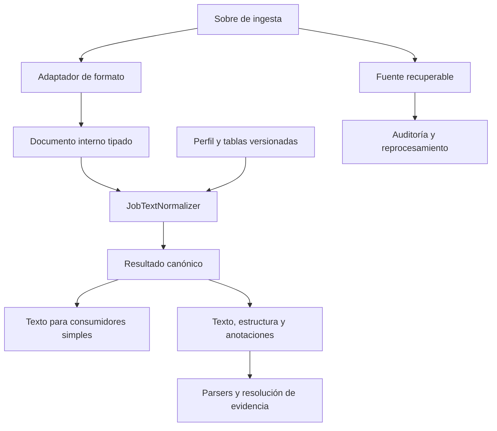

# normietext

## Especificación funcional, arquitectura y diseño técnico

| Atributo | Valor |
|---|---|
| Proyecto y herramienta | **normietext** |
| Versión de la especificación | **2.0** |
| Fecha de referencia | **24 de septiembre de 2026** |
| Estado | Especificación de referencia para implementación y validación |
| Dominio | Texto de ofertas laborales extraído de LinkedIn |
| Naturaleza | Biblioteca Python local, determinista y sin LLM |
| Perfil normativo | `linkedin_jobs_aggressive_v1` |
| Idiomas prioritarios de validación | Español, inglés, portugués y mezclas entre ellos |
| Runtime objetivo | CPython 3.14.7, build estándar con GIL |
| Entrega principal | Seis campos normalizados, estructura, anotaciones, incidencias y procedencia |

La versión de esta especificación no implica la existencia de una versión publicada del paquete. La versión del software, la del esquema y la de las reglas se administran por separado.

---

## Contenido

1. Resumen ejecutivo
2. Contexto, problema y objetivos
3. Alcance y límites
4. Terminología y convenciones normativas
5. Principios y decisiones de producto
6. Requisitos funcionales y no funcionales
7. Contrato de entrada
8. Contrato de salida y procedencia
9. Arquitectura del sistema
10. Conversión de formatos y tratamiento de HTML
11. Reparación de codificación
12. Política Unicode, invisibles y controles
13. Política de emoji y señales visuales
14. Listas, bloques y relaciones estructurales
15. Política de espacios y saltos de línea
16. Puntuación, sintaxis técnica y contenido protegido
17. Política específica por campo
18. Pipeline y contratos entre etapas
19. API pública y modelos
20. Integración con parsing y modelo de evidencia
21. Stack, dependencias y entorno reproducible
22. Organización interna del paquete
23. Errores, límites y seguridad
24. Estrategia de pruebas y corpus
25. Métricas, observabilidad y rendimiento
26. Criterios de aceptación
27. Implementación, despliegue y mantenimiento
28. Referencias técnicas
29. Apéndice A: configuración normativa
30. Apéndice B: matriz de regresión
31. Apéndice C: caso integral de referencia
32. Apéndice D: inventario de evidencia del caso integral

---

## 1. Resumen ejecutivo

**normietext** transforma campos textuales de ofertas laborales en una representación estable y preparada para parsing. Conserva el contenido léxico y las señales necesarias para extraer títulos, responsabilidades, habilidades, modalidad, ubicación, seniority, tipo de empleo y compensación.

La herramienta opera sobre seis campos independientes:

```text
job_title
job_description
job_criteria_list
job_type
seniority
raw_location
```

El componente central, `JobTextNormalizer`, es propietario de las políticas. Las bibliotecas externas aportan mecanismos delimitados para HTML, reparación de mojibake, Unicode y reconocimiento de secuencias emoji.

La política del proyecto combina dos enfoques deliberados:

- **Conservación del contenido:** no traducir, corregir ortografía globalmente, eliminar números, suprimir signos técnicos ni resolver entidades semánticas.
- **Reducción agresiva del ruido visual:** eliminar la mayoría de los emoji, eliminar caracteres invisibles y de formato, colapsar espacios y sangrías, y permitir como máximo una línea vacía entre bloques.

Un conjunto pequeño y explícito de emoji informativos se representa mediante tokens legibles y anotaciones tipadas. Las banderas se conservan como evidencia regional, sin determinar por sí solas la ubicación del empleo.

La arquitectura separa la **conversión del formato de origen**, ejecutada una sola vez, de la **canonicalización de una representación interna**. Esta separación evita reinterpretar texto literal como HTML y permite definir correctamente la idempotencia.

El resultado no se limita a una cadena: incluye texto, bloques, anotaciones, incidencias, referencia recuperable a la fuente y manifestación de las reglas aplicadas. Una fachada devuelve solo texto para consumidores sencillos.

**La limpieza normaliza representación. El parser reconoce entidades, interpreta contexto y resuelve significado.**

## 2. Contexto, problema y objetivos

### 2.1 Naturaleza de los datos

Los campos extraídos pueden contener HTML residual, entidades escapadas, mojibake, texto multilingüe, errores ortográficos, información repetida, emoji, listas, tablas, código y contenido ubicado en un campo nominalmente incorrecto.

Un título puede incluir modalidad, ubicación y salario. Una descripción puede aportar seniority aunque el campo específico contenga `Not Specified`. El normalizador no debe descartar contenido por no coincidir con el nombre del campo.

La normalización no puede reconstruir de forma fiable evidencia que el scraper haya perdido. Si dos elementos se concatenaron como `PythonAWS`, no existe una regla universal que permita recuperar sus límites sin interpretación semántica.

### 2.2 Objetivos

1. Producir representaciones consistentes para extracción posterior.
2. Preservar contenido léxico, cifras, negaciones, condiciones y relaciones estructurales relevantes.
3. Reducir ruido visual de manera predecible y verificable.
4. Mantener independientes los campos y sus fuentes.
5. Permitir auditoría y reprocesamiento desde la entrada original.
6. Evitar interpretaciones semánticas anticipadas.
7. Ejecutarse localmente, sin aleatoriedad ni dependencias de red durante la normalización.
8. Hacer explícitas las pérdidas aceptadas y los casos no recuperables.

### 2.3 Distribución inicial y generalización

El corpus inicial prioriza ofertas técnicas con español, inglés y portugués, incluidas mezclas dentro de una oración. Se aceptan otras escrituras Unicode, pero la eliminación obligatoria de caracteres de unión, dirección y formato puede afectar su representación lingüística. No se declara fidelidad ortográfica universal.

Las garantías se expresan sobre reglas e invariantes verificables y sobre un corpus publicado internamente. Una muestra sin errores conocidos no constituye una garantía de ausencia de errores en toda entrada posible.

## 3. Alcance y límites

### 3.1 Incluido

- Validación de entradas y límites operativos.
- Interpretación de formatos declarados.
- Conversión estructural de fragmentos HTML.
- Decodificación controlada de entidades.
- Reparación acotada de mojibake.
- Normalización Unicode NFC.
- Eliminación de invisibles, controles y caracteres de formato según tablas versionadas.
- Reconocimiento de emoji antes de eliminar los caracteres que componen sus secuencias.
- Eliminación mayoritaria de emoji y conservación de una allowlist de señales.
- Normalización contextual de listas y extracción de relaciones estructurales.
- Eliminación acotada de kaomoji reconocidos.
- Colapso de espacios, eliminación de sangrías y compactación de líneas vacías.
- Trazabilidad de cambios, validación, métricas y evaluación de integración.

### 3.2 Excluido

- Scraping, navegación, obtención de credenciales o adquisición de ofertas.
- Traducción y corrección ortográfica general.
- Resolución geográfica, geocodificación y expansión de abreviaturas.
- Extracción o normalización final de habilidades, salarios o modalidades.
- Decidir si una cantidad es salario, presupuesto, coste técnico o bono.
- Resolver contradicciones entre campos.
- Clasificación automática de seniority o tipo de empleo.
- Deducción de hechos ausentes.
- Modelos de lenguaje, embeddings, modelos NLP y servicios remotos dentro del cleaner.
- Deduplicación semántica de anuncios o eliminación de secciones por su temática.
- Sanitización de HTML para presentación web.

### 3.3 Ejemplos de frontera

| Operación | Responsable |
|---|---|
| `José` → `José` | Reparación textual |
| `• Python` → `- Python` | Normalización estructural |
| `🇨🇷` → `[flag:CR]` con anotación | Normalización de señal visual |
| `CR` → `Costa Rica` | Parser geográfico |
| `Sr.` → `Senior` | Parser de seniority |
| `K8s` → `Kubernetes` | Parser de habilidades |
| `US$55k` → importe y moneda | Parser de compensación |
| `Híbrido` → taxonomía de modalidad | Parser de modalidad |
| `Enginner` → `Engineer` | Resolución posterior, si se autoriza |

## 4. Terminología y convenciones normativas

**DEBE** y **NO DEBE** indican requisitos obligatorios. **DEBERÍA** indica una recomendación cuya excepción debe justificarse. **PUEDE** indica una capacidad opcional.

| Término | Definición |
|---|---|
| Fuente | Valor exacto recibido para un campo, antes de modificarlo |
| Formato de origen | Declaración de cómo interpretar ese valor |
| Documento interno | Secuencia tipada de contenido y límites estructurales obtenida del adaptador |
| Texto canónico | Proyección textual final del documento normalizado |
| Anotación | Dato generado sobre un segmento, con tipo y procedencia |
| Bloque | Párrafo, encabezado, línea, elemento de lista, celda o fragmento de código |
| Edición | Transformación registrada mediante una regla identificable |
| Incidencia | Condición relevante para interpretar calidad o completitud |
| Vista derivada | Representación temporal específica para matching de un parser |
| Evidencia | Contenido observado; no equivale a un hecho semántico resuelto |
| Perfil | Conjunto completo y versionado de políticas de normalización |

Los offsets usan índices de puntos de código de Python sobre cadenas Unicode, con intervalos semiabiertos `[start, end)`. No representan bytes UTF-8 ni unidades UTF-16.

## 5. Principios y decisiones de producto

### 5.1 Preservación y pérdidas aceptadas

normietext DEBE conservar la entrada original o una referencia recuperable a ella. La salida canónica es una representación deliberadamente reductora y no reversible por sí sola.

Se aceptan estas pérdidas en la proyección textual:

- Identidad de emoji fuera de la allowlist.
- Caracteres invisibles, de unión, dirección y formato definidos por la política.
- Multiplicidad de espacios, tabulaciones, sangrías y líneas vacías adicionales.
- Forma visual original de marcadores de lista normalizados.
- Kaomoji exactos incluidos en el catálogo del perfil.

Las relaciones estructurales reconocidas DEBEN capturarse antes de eliminar la información visual que las expresa. La fuente preservada permite investigar o reprocesar cualquier pérdida aceptada.

### 5.2 Contenido conservado

No se suprimen globalmente mayúsculas, acentos, números, símbolos monetarios, porcentajes, signos de comparación, URLs, correos, teléfonos, hashtags, IDs, negaciones, condiciones, disclaimers ni secciones legales.

### 5.3 Determinismo

La misma entrada, formato, configuración, reglas y entorno efectivo DEBEN producir el mismo resultado semántico serializado en toda ejecución completada correctamente.

Tiempos de ejecución, timestamps de ingesta y detalles de infraestructura se almacenan fuera de esa representación determinista. Un timeout se representa como fallo operativo, no como una segunda salida canónica aceptable.

### 5.4 Idempotencia

La canonicalización tipada DEBE satisfacer:

```python
canonicalize(canonicalize(document)) == canonicalize(document)
```

La segunda llamada no vuelve a interpretar HTML, decodificar entidades, reparar mojibake de origen ni duplicar anotaciones o ediciones. Un documento canónico incluye perfil, versión y fase. La operación valida esa fase y devuelve el mismo valor inmutable cuando es compatible.

La conversión de origen no tiene contrato `str -> str` idempotente. Una cadena resultante como `<b>Python</b>` puede ser texto literal; no se envía de nuevo al adaptador HTML automáticamente.

Cambiar perfil o versión requiere reprocesar la fuente, no tratar la salida anterior como una fuente equivalente.

### 5.5 Autonomía de políticas

Las bibliotecas no gobiernan el pipeline completo. Cada llamada externa DEBE tener alcance, configuración, pruebas y responsable definidos. No se admiten reparaciones o fallbacks silenciosos que dependan de qué paquetes estén instalados.

## 6. Requisitos funcionales y no funcionales

### 6.1 Requisitos funcionales

| ID | Requisito |
|---|---|
| RF-01 | Aceptar únicamente valores `str` y campos reconocidos en la API de campo |
| RF-02 | Diferenciar texto, HTML y texto escapado mediante formato declarado |
| RF-03 | Preservar fuente y procedencia por campo |
| RF-04 | Convertir HTML conservando límites y relaciones reconocidas |
| RF-05 | Reparar mojibake con configuración explícita |
| RF-06 | Emitir texto final en NFC y codificable como UTF-8 estricto |
| RF-07 | Eliminar invisibles y formato según §12 |
| RF-08 | Eliminar los emoji no permitidos según §13 |
| RF-09 | Convertir señales permitidas en tokens con anotaciones |
| RF-10 | Normalizar listas sin renumerar valores originales |
| RF-11 | Emitir solo espacios ASCII simples y saltos LF, con máximo una línea vacía |
| RF-12 | Conservar evidencia textual técnica, geográfica y económica |
| RF-13 | Registrar transformaciones destructivas y estados de calidad |
| RF-14 | Exponer API de campo, de registro y proyección solo texto |
| RF-15 | Mantener idempotencia del documento canónico y determinismo de ejecuciones correctas |

### 6.2 Requisitos no funcionales

- Sin acceso de red en el camino de normalización.
- Funciones pequeñas y puras cuando corresponda; configuración inmutable.
- Límites de tamaño y complejidad antes de operaciones costosas.
- Tests unitarios, de composición, propiedades y corpus desde el inicio.
- Entorno reproducible y manifestación de dependencias efectivas.
- No perder silenciosamente registros ni truncar contenidos.
- Evaluación de rendimiento sobre distribución real y casos adversariales.
- Trazabilidad suficiente sin almacenar todos los snapshots intermedios en producción.

## 7. Contrato de entrada

### 7.1 Campos

| Campo | Contenido nominal | Consideración obligatoria |
|---|---|---|
| `job_title` | Título | Puede contener empresa, modalidad, salario, ubicación y referencias |
| `job_description` | Cuerpo de oferta | Puede contener cualquier evidencia objetivo y contenido no objetivo |
| `job_criteria_list` | Criterios | Debe conservar etiquetas, valores y asociaciones disponibles |
| `job_type` | Tipo de empleo | No mapear todavía a taxonomía |
| `seniority` | Nivel | Conservar `Not Specified` y otros valores literales |
| `raw_location` | Ubicación textual | No inventar jerarquía ni resolver entre varias menciones |

### 7.2 Sobre de campo

```python
FieldInput(
    field=JobField.JOB_DESCRIPTION,
    value=raw_value,
    source_format=SourceFormat.PLAIN_TEXT,
    source_ref="record/123/job_description",
    source_adapter_version="linkedin-adapter/1.0.0",
)
```

`source_ref` DEBE identificar una fuente recuperable para ingesta persistente. En uso local, el resultado conserva `raw` cuando no se proporciona un almacén de fuentes. Un hash por sí solo no satisface recuperabilidad.

### 7.3 Formatos

| Formato | Interpretación |
|---|---|
| `plain_text` | Texto literal. No interpretar etiquetas ni entidades |
| `html_fragment` | Un fragmento HTML; parseo estructural exactamente una vez |
| `html_escaped_text` | Decodificar una capa declarada de referencias HTML y tratar el resultado como texto literal |
| `unknown` | Procesar como texto literal y añadir `SOURCE_FORMAT_UNKNOWN` |

No se incluye autodetección destructiva en el perfil normativo. La presencia de `<`, `>` o `&` no habilita parsing HTML. Las entradas doblemente escapadas requieren corrección explícita del adaptador de origen; no se decodifican recursivamente hasta un punto fijo.

### 7.4 Estado de extracción

La API de campo rechaza `None`, bytes y valores no textuales. El sobre de ingesta de registro distingue `present`, `missing` y `extraction_error`; solo `present` contiene `FieldInput` y se normaliza.

Una cadena vacía es válida. No se transforma una ausencia o un error en `""`. El helper estricto de seis campos exige las seis claves y sus estados; detecta claves desconocidas en lugar de ignorarlas silenciosamente.

### 7.5 Responsabilidades del scraper

El adaptador DEBERÍA conservar fragmentos HTML relevantes, asociaciones etiqueta–valor y metadatos estructurados disponibles. Si obtiene JSON-LD u otra fuente estructurada, la entrega por un canal de evidencia separado; el cleaner no busca hechos en scripts.

La herramienta no deduce automáticamente dónde termina un título y empieza una descripción dentro de una cadena combinada. Esa separación corresponde al origen o al contrato explícito del fixture.

## 8. Contrato de salida y procedencia

### 8.1 Resultado de campo

```text
NormalizedField
  field
  text
  status
  source_ref / raw
  source_format
  blocks[]
  annotations[]
  edits[]
  issues[]
  manifest
```

`status` distingue `ok`, `ok_with_issues` y `empty`. Un fallo no produce `NormalizedField`: produce un resultado de error separado y preserva la fuente en el sobre de ingesta.

El manifiesto incluye `schema_version`, `normalization_version`, `policy_id`, `policy_hash`, `code_revision`, versiones de runtime y dependencias, y versiones/hashes de las tablas propias. La referencia al manifiesto puede compartirse entre registros para evitar duplicación.

### 8.2 Bloques y relaciones

Tipos mínimos: `paragraph`, `line`, `heading`, `list_item`, `table_cell`, `code`. Se almacenan spans finales y, cuando estén disponibles, `parent_id`, `list_id`, `ordinal`, `depth`, `row`, `column` y referencia al bloque de origen.

La identificación de encabezados por HTML es estructural. En texto plano, una línea aislada se conserva sin necesidad de clasificar semánticamente su contenido como requisitos, beneficios o salario.

La profundidad y las continuaciones reconocidas sobreviven en metadatos aunque el texto final no tenga sangría. No se inventan relaciones cuando el origen ya las perdió.

### 8.3 Anotaciones

Cada anotación DEBE incluir:

- Tipo, regla y payload de representación, no una conclusión de negocio.
- Span en el texto canónico, si tiene una proyección visible.
- Referencia y span de origen cuando puedan determinarse.
- Precisión de procedencia: `exact`, `segment` o `field`.
- Identificador estable derivado del campo, fuente, regla y posición.

Ejemplo conceptual:

```json
{
  "kind": "emoji_region",
  "value": "CR",
  "rendered_token": "[flag:CR]",
  "source_text": "🇨🇷",
  "rule_id": "emoji.region_token",
  "origin_precision": "exact"
}
```

Los spans se añaden con valores calculados; no se estiman manualmente. Una bandera no se anota como `job_country`.

### 8.4 Colisiones de tokens

Si el autor escribió literalmente `[flag:CR]`, la cadena se conserva, pero no se crea una anotación de bandera. El parser DEBE consultar anotaciones para identificar tokens generados. No debe confiar en la forma textual por sí sola.

La proyección solo texto puede contener la misma cadena para dos procedencias diferentes. Esa ambigüedad es una limitación explícita de esa proyección, no del resultado enriquecido. No se insertan sentinelas invisibles para resolverla.

### 8.5 Ediciones y alineación

Toda eliminación de emoji, invisibles o kaomoji y toda sustitución de marcadores DEBE quedar atribuida a una regla. Cambios repetidos de espacios pueden agregarse por segmento si la fuente sigue disponible.

Un mapa de alineación admite relaciones muchos-a-uno y uno-a-muchos. Para HTML malformado o reparaciones complejas puede degradarse a procedencia de segmento; nunca se declaran offsets exactos sin evidencia. Los spans finales se calculan después de renderizar y aplicar NFC final.

No se requiere guardar todas las cadenas intermedias. El modo trace es opcional y no cambia el resultado canónico.

## 9. Arquitectura del sistema



### 9.1 Componentes

| Componente | Responsabilidad |
|---|---|
| Adaptador de ingesta | Campos, formato, estado de extracción y referencia de fuente |
| Adaptadores de formato | Conversión de texto/HTML/entidades a documento interno |
| Reparador textual | Mojibake acotado sin controlar el pipeline completo |
| Analizador estructural | Bloques, listas, continuaciones y contextos especiales |
| Normalizador de símbolos | Emoji, hints, invisibles y kaomoji |
| Renderer | Texto canónico y spans finales |
| Validador | Invariantes y límites |
| Fachada de registro | Procesamiento independiente y agregado de estados |

El núcleo no necesita servicios distribuidos. La paralelización, almacenamiento y orquestación de lotes se implementan fuera de las funciones de normalización.

## 10. Conversión de formatos y tratamiento de HTML

### 10.1 Texto literal

`plain_text` conserva expresiones como `List<T>`, `< $0.03/query` y ejemplos de `<br>`. No aplica `html.unescape`. Los asteriscos, hashtags y backticks no activan un parser Markdown implícito.

### 10.2 Entidades

`html_escaped_text` decodifica una sola capa mediante una operación explícita. El resultado queda marcado como texto literal. `&amp;lt;b&amp;gt;` puede terminar como `&lt;b&gt;`; no hay otra decodificación oculta.

El parser HTML ya interpreta referencias de caracteres en el contexto del fragmento. No se aplica después un `unescape` global sobre su texto. `ftfy` no recibe responsabilidad sobre entidades.

### 10.3 Backend

Se utiliza Beautiful Soup con backend `lxml` explícito. La configuración efectiva debe usar un parser HTML local, sin resolución de red y sin opciones para documentos desmesurados. La selección no depende de paquetes presentes incidentalmente.

Las diferencias de recuperación de HTML malformado forman parte del comportamiento versionado. No se cambia de backend silenciosamente al producirse un error. [R4][R5]

### 10.4 Serialización estructural

| Elemento | Tratamiento |
|---|---|
| `<br>` | Límite de línea |
| `<p>` | Bloque de párrafo |
| `<div>` | Límite de bloque cuando delimita contenido; evitar duplicar separadores vacíos |
| `<h1>`–`<h6>` | Encabezado con nivel |
| `<ul>`, `<ol>`, `<li>` | Lista, pertenencia, profundidad y ordinal |
| Inline: `<b>`, `<strong>`, `<em>`, `<span>` | Conservar texto sin introducir espacios automáticos |
| `<pre>`, `<code>` | Identificar contexto de código antes de compactar espacios |
| `<table>`, `<tr>`, `<td>`, `<th>` | Conservar filas, columnas y asociaciones en bloques |
| `<a>` | Texto visible; `href` y etiqueta como metadatos, sin navegar |
| `` | `alt` no vacío como contenido alternativo diferenciado; no OCR |
| `script`, `style`, comentarios | Excluir del texto; conservar fuente |
| `template` | Excluir contenido no presentado por el fragmento base |

`C<b>++</b>` DEBE producir `C++`. `Python<br>AWS` DEBE producir dos líneas. No se utiliza un único separador global entre todos los nodos.

Las tablas se proyectan con ` | ` entre celdas y LF entre filas; el contenido de una celda se compacta a una línea. Los metadatos de celdas, no el carácter `|`, son la fuente autoritativa de sus límites. Se preservan celdas vacías y se registran `rowspan`/`colspan` cuando existan; no se infieren valores repetidos.

Las listas ordenadas respetan `start`, `value` y `reversed` cuando estén presentes y sean válidos. Se conserva el ordinal numérico computado; presentaciones alfabéticas o romanas se registran como estilo de origen. Atributos inválidos generan incidencia y un tratamiento documentado, sin inventar números de negocio.

El parser no ejecuta CSS. No promete reproducir exactamente visibilidad o layout de un navegador. Los casos de contenido oculto requieren decisiones en el adaptador y pruebas específicas del origen.

### 10.5 Recuperación y pérdida

La recuperación de HTML roto puede omitir contenido. Deben conservarse fuente e incidencias disponibles del parser; una salida corta respecto de la entrada es una señal de observación, no una prueba suficiente de pérdida. No se exige que desaparezca toda cadena con forma de etiqueta: puede ser contenido literal legítimo.

## 11. Reparación de codificación

La función base es `ftfy.fix_encoding`, con configuración explícita y explicación disponible mediante `fix_encoding_and_explain`. No se utiliza `fix_text()` con sus defaults como pipeline global. [R3]

Configuración inicial del perfil:

```text
restore_byte_a0 = false
replace_lossy_sequences = false
decode_inconsistent_utf8 = true
fix_c1_controls = true
```

Los demás arreglos de `fix_text` no forman parte de esta llamada. El perfil permite reparar secuencias evidentes en texto mixto, pero evita reconstrucciones basadas en espacios y sustituciones de secuencias ya perdidas. Su desempeño se valida con ejemplos positivos y falsos positivos.

La reparación ocurre una vez sobre unidades textuales lógicas después de la conversión de formato y antes de borrar controles. Un fragmento HTML con corrupción que afecte sus propios delimitadores se trata como incidencia de origen; no se aplica una reparación global previa al marcado sin un adaptador específico versionado.

Los separadores de línea reales definidos en §15 se tokenizan como límites antes de entregar las unidades a `ftfy`. En particular, un `U+0085 NEL` literal se interpreta como límite de línea y no se deja a `fix_c1_controls` para convertirlo en puntuación. Esta precedencia puede impedir recuperar una secuencia mojibake que contenga ese mismo punto de código; se registra como limitación del perfil y se conserva la fuente. No se cambia de interpretación según una segunda pasada.

Ejemplos:

```text
José -> José
Enginner -> Enginner
Prompt Enginering -> Prompt Enginering
```

Un carácter de reemplazo `�` se conserva y genera `REPLACEMENT_CHARACTER_PRESENT`. El sistema no afirma haber recuperado lo que no está en la entrada.

## 12. Política Unicode, invisibles y controles

### 12.1 NFC y contenido léxico

La salida DEBE estar en NFC. Se aplica una pasada final después de eliminaciones y sustituciones que puedan modificar adyacencias. No se aplica NFKC global, transliteración, eliminación de diacríticos ni conversión global a minúsculas. [R2][R9]

### 12.2 Conjunto normativo de eliminación

Después de reconocer secuencias emoji y estructura, se eliminan de la salida textual:

- Todos los caracteres con categoría `Cf` según las tablas fijadas del perfil.
- `Default_Ignorable_Code_Point`, incluidos selectores de variación y caracteres de unión o etiquetado que hayan quedado fuera de secuencias ya consumidas.
- Controles `Cc`, excepto LF; los controles de espacio y línea se convierten antes según §15.
- `U+2800 BRAILLE PATTERN BLANK`, tratado por este perfil como ruido visual.

La clasificación se centraliza en tablas versionadas; no se mezcla una clasificación incidental de distintas bibliotecas sin política. Se DEBE registrar la versión de las propiedades usadas. [R10]

Esto incluye ZWJ, ZWNJ, ZERO WIDTH SPACE, soft hyphen, BOM, controles bidi y marcas de formato. No hay una excepción lingüística en el texto canónico. La pérdida se acepta para este uso y se conserva la fuente.

No se elimina toda categoría `M`: las marcas combinantes de acentos y otras escrituras siguen siendo contenido. No se elimina toda categoría `C`: caracteres privados o no asignados no se descartan por esa razón.

La noción operativa de invisible es la definida por estas propiedades y excepciones, no una inspección visual dependiente de la fuente tipográfica. Los nuevos caracteres fuera de las tablas requieren actualizar el perfil.

### 12.3 Eliminación frente a separación

Los caracteres de formato se eliminan sin insertar automáticamente espacios:

```text
py\u200bthon -> python
data\u200bscience -> datascience
a\u200b\u0301 -> á
```

La última transformación exige NFC final. El segundo caso es una pérdida aceptada; no se adivina si había un límite de palabra. NBSP y otros separadores de espacio son otra clase: se convierten en espacio ASCII.

### 12.4 Secuencias y validez

Las banderas de subdivisiones y los emoji ZWJ se reconocen antes de eliminar sus componentes de formato. La salida no conserva selectores ni controles residuales.

Las entradas con sustitutos aislados se rechazan con `INVALID_UNICODE`. No se emite UTF-8 con `surrogatepass`. Los caracteres privados o no asignados se preservan, con incidencia cuando sea útil; no se interpretan como emoji por defecto.

## 13. Política de emoji y señales visuales

### 13.1 Regla general

**Se elimina todo emoji reconocido que no pertenezca a la allowlist, no sea un marcador estructural consumido y no esté protegido expresamente como símbolo textual.** No se ejecuta una clasificación semántica para decidir si un emoji no permitido es decorativo en una oración concreta.

La preferencia de producto es reducir ruido incluso cuando un emoji eliminado pudiera tener significado. La fuente y el registro de edición permiten revisar esa pérdida.

### 13.2 Reconocimiento y precedencia

Orden de decisión:

1. Símbolos textuales protegidos.
2. Secuencias de banderas regionales o subdivisiones válidas en la tabla fijada.
3. Marcadores de lista reconocidos, incluidos keycaps y gestos de viñeta.
4. Allowlist de hints.
5. Otros emoji reconocidos: eliminación.
6. Secuencias pictográficas no incluidas en el catálogo: eliminación solo cuando cumplan la gramática de candidato definida abajo.
7. Otros símbolos desconocidos: conservación.

`emoji` proporciona coincidencias y spans. Para secuencias no catalogadas, se admite un candidato formado por unidades pictográficas `Extended_Pictographic`, sus modificadores/selectores y uniones ZWJ, sin letras, cifras u otro contenido textual dentro de la secuencia consumida. Modificadores emoji aislados también se eliminan. Indicadores regionales incompletos o pares inválidos se eliminan con incidencia, no se convierten en geografía.

El matcher no consume grafemas completos arbitrarios que contengan letras junto a un pictograma. Si no puede separar con seguridad contenido textual y componentes pictográficos, conserva el segmento e informa `UNCLASSIFIED_SYMBOL_SEQUENCE`.

No se usa `\p{Emoji}` como regla global de borrado: puede abarcar bases como números, `#` y `*`. Las secuencias y sus componentes se manejan explícitamente. [R6][R7][R8]

### 13.3 Allowlist inicial

| Secuencia o grupo exacto | Proyección | Anotación |
|---|---|---|
| Banderas regionales válidas | `[flag:CR]`, `[flag:MX]`, etc. | `emoji_region` y subtag regional |
| Banderas de subdivisión válidas | `[flag-subdivision:gbeng]`, etc. | `emoji_subdivision` y código |
| `💰` | `[emoji:money_bag]` | `emoji_hint` |
| `📍` | `[emoji:round_pushpin]` | `emoji_hint` |
| `⚠` y `⚠️` | `[emoji:warning]` | `emoji_hint` |
| `✅` | `[emoji:check_mark_button]` | `emoji_hint` |
| `❌` | `[emoji:cross_mark]` | `emoji_hint` |

Las variantes de presentación de las bases de la allowlist se enumeran en la tabla de política. No se permiten sinónimos por parecido visual ni por nombre traducido. Esta lista pequeña se cambia solo mediante una nueva versión de reglas.

`EU` y `UN` son regiones válidas del catálogo de banderas, no países inferidos. Las banderas no regionales, como banderas temáticas, se eliminan si no están explícitamente incluidas.

Los tokens describen el símbolo. `[emoji:money_bag]` no significa que toda cantidad próxima sea salario. `[emoji:cross_mark]` no se convierte automáticamente en la palabra `no`.

### 13.4 Símbolos textuales protegidos

Se conservan `©`, `®`, `™`, dígitos, `#`, `*`, signos matemáticos, monedas y flechas textuales. Una variante de presentación emoji de `©`, `®` o `™` produce el símbolo base sin selector. No se elimina `C#`, hashtags o números por participar potencialmente en una secuencia emoji.

`→` solo se convierte en viñeta cuando satisface las reglas estructurales. En `11 → expected 15` se conserva.

### 13.5 Keycaps y gestos

Un keycap numérico representa un número visible: `1️⃣` se convierte en `1`; si es un marcador de lista reconocido, produce `1. `. Los keycaps de `#` y `*` preservan la base, sin deducir numeración.

`👉` al inicio de una línea con texto se trata como viñeta si cumple §14. Fuera de ese contexto se elimina. Otros gestos no se convierten en listas por analogía.

### 13.6 Separadores alrededor de eliminaciones

La eliminación de un emoji DEBE evitar concatenar dos tramos alfanuméricos que estaban separados exclusivamente por él. Se inserta un espacio si ambos vecinos sobrevivientes inmediatos son letras, marcas o números. Si uno es puntuación, espacio, salto de línea o límite de campo, no se inserta un espacio adicional por defecto.

```text
foo🚀bar -> foo bar
piña🍍 -> piña
"piña🍍" -> "piña"
Benefits ✨ -> Benefits
```

No se promete conservar instrucciones cuyo significado dependa de un emoji no permitido. La frase de aplicación que contiene `piña🍍` conservará `piña`; la representación original sigue disponible en la fuente.

Los tokens conservados se separan de palabras adyacentes mediante espacios cuando sea necesario. Todos los espacios introducidos pasan por el renderer final.

Al retirar emoji o kaomoji, se repara también su hueco inmediato: si entre el contenido anterior y el siguiente signo de cierre o puntuación solo quedan espacios del hueco eliminado, esos espacios se suprimen ante `, . ; : ! ? ) ] }`. Esta regla localizada no se aplica a otros espacios del documento, ni elimina el espacio antes de `%` en `81,4 %`. Por ejemplo, `texto 🍕, siguiente` produce `texto, siguiente` y `SEO ¯\_(ツ)_/¯ :` produce `SEO:`. Una elipsis que sigue al hueco queda adyacente al texto anterior.

## 14. Listas, bloques y relaciones estructurales

### 14.1 Representación

La forma canónica de un elemento no ordenado es `- texto`. La de uno ordenado es `N. texto`. No se renumera una lista para completar huecos o corregir saltos.

```text
① Recruiter -> 1. Recruiter
2.) Technical -> 2. Technical
1. A / 3. B / 7. C -> conservar los tres ordinales
```

La última línea es notación explicativa, no una regla que transforme barras en saltos.

### 14.2 Marcadores

- `•`, `▪`, `◦` y `‣` se normalizan cuando son el primer marcador visible de una línea y van seguidos de espacio y contenido.
- `- ` ya es canónico. No consumir `--version`, signos negativos ni rangos.
- `👉` seguido de espacio y contenido al inicio de línea se convierte en `- `.
- `→` y guiones tipográficos como viñetas requieren contexto de lista: al menos dos líneas vecinas compatibles dentro del mismo bloque.
- Números encerrados y keycaps se convierten solo como prefijo de lista con contenido; fuera de ese contexto, los números encerrados se conservan y los keycaps siguen §13.5.
- `N)`, `N.)` y `N.` seguidos de espacio y contenido se reconocen, salvo contextos protegidos o patrones de decimal/versiones.
- `N - texto` requiere continuidad con una lista ordenada en el bloque: ordinal previo `N-1` o siguiente `N+1`. No se transforma si el cuerpo comienza con una cifra, un signo numérico o una forma de rango.

`6 - Offer` después de `5.) Cultural/team chat` se convierte en `6. Offer`. Aislado se conserva. Las numeraciones no ambiguas se conservan aunque tengan huecos.

### 14.3 Contexto virtual sin ruido

La detección de prefijos usa una vista léxica en la que emoji destinados a eliminación e invisibles no ocultan un marcador al inicio de línea. Las ediciones se aplican después de clasificar los tokens. Así, `🚀• Python` puede normalizarse en una sola ejecución, sin repetir el pipeline completo.

Los hints permitidos no se descartan de esa vista como si fueran decoración.

### 14.4 Continuaciones y anidamiento

Antes de compactar sangrías se capturan relaciones explícitas del DOM y relaciones de continuación de alta confianza en texto plano. La estructura ambigua se conserva como líneas independientes.

En texto plano, una línea sin marcador, con sangría de origen mayor que la del marcador activo y sin línea vacía intermedia, se registra como continuación de ese elemento. Un nuevo marcador en el mismo nivel cierra el elemento; un marcador de mayor sangría abre una lista hija. Para comparar sangrías, un TAB avanza hasta el siguiente múltiplo de cuatro columnas; ese ancho es solo un instrumento estructural y no se conserva en el texto. Una línea sin sangría no se asigna por cercanía únicamente. Las relaciones del DOM tienen precedencia sobre estas heurísticas.

El contexto `code` se establece a partir de `<pre>`, `<code>`, metadatos explícitos de origen o delimitadores de bloque de código reconocidos por el analizador léxico. No se necesita interpretar Markdown completo ni deducir un lenguaje. Un fragmento con apariencia de Python en texto plano puede mantenerse como continuación sin etiquetarse como código; no se promete identificar todos los snippets.

En la salida textual no hay sangría, incluso para listas anidadas o código. La profundidad y pertenencia reconocidas permanecen en `blocks`. El texto por sí solo no garantiza reconstrucción íntegra de anidamiento o código ejecutable.

### 14.5 Kaomoji

Se permite eliminar un catálogo corto de secuencias exactas de alta confianza, inicialmente `¯\_(ツ)_/¯`, `ಠ_ಠ` y `(ಥ﹏ಥ)`, como unidades delimitadas. No se usan patrones amplios que borren paréntesis, emoticonos ASCII genéricos o contenido arbitrario entre signos.

`(+506)`, `(UTC-6)`, `(CR)`, `C++` y `< $0.03` se conservan. `:)` se conserva en este perfil. Las eliminaciones respetan la regla de separación alfanumérica y quedan registradas.

## 15. Política de espacios y saltos de línea

### 15.1 Invariantes de salida

En todos los campos:

1. El único espacio horizontal es `U+0020 SPACE`.
2. No existen dos espacios ASCII consecutivos.
3. No hay tabulaciones ni sangría inicial de línea.
4. No hay espacios finales de línea.
5. El único salto de línea es `U+000A LF`.
6. No hay tres LF consecutivos: `\n\n` representa una única línea vacía.
7. No hay espacios ni saltos al principio o final del campo.

SPACE y LF son los separadores estructurales permitidos. Los demás caracteres invisibles o de formato definidos en §12 no permanecen en el texto. La política también se aplica dentro de código y a contenido alternativo proyectado.

### 15.2 Conversión

| Entrada | Resultado |
|---|---|
| `CRLF`, `CR`, `NEL`, `LINE SEPARATOR`, `PARAGRAPH SEPARATOR`, `VT`, `FF` | LF; CRLF se trata como una unidad |
| TAB y separadores horizontales Unicode, incluido NBSP y espacio estrecho inseparable | SPACE |
| Secuencia horizontal de espacios | Un SPACE |
| Línea compuesta solo por espacios | Línea vacía |
| Varias líneas vacías contiguas | Una línea vacía |
| Sangría inicial | Eliminación después de capturar estructura |

En campos multilineales se conserva un salto existente entre líneas no vacías. No se unen automáticamente líneas de párrafo ni continuaciones. No se añade una línea vacía entre cada viñeta; se conserva o genera solo el límite de bloque correspondiente.

### 15.3 Campos compactos

`job_title`, `job_type`, `seniority` y `raw_location` se proyectan en una sola línea: todos sus límites de bloque se convierten en SPACE. Los bloques reconocidos quedan en metadatos.

`job_description` y `job_criteria_list` conservan LF y hasta una línea vacía. La ausencia de sangría no autoriza a perder las relaciones previamente registradas.

### 15.4 Límites de fidelidad

Un código cuya indentación sea semántica no permanece ejecutable en la proyección. No se introduce una excepción de espacios para código. La fuente y el bloque identificado permiten a un consumidor recuperar el fragmento original si lo necesita.

El colapso de espaciado no elimina espacios entre grupos numéricos: `2 400 000` se convierte en `2 400 000`, no en `2400000`. La interpretación numérica pertenece al parser.

## 16. Puntuación, sintaxis técnica y contenido protegido

El perfil mantiene comillas curvas, apóstrofos, guiones tipográficos, signo menos, elipsis y puntuación repetida. No se transforma globalmente `—`, `–` o `−` en `-`. Los parsers pueden construir una vista de comparación equivalente con alineación a la evidencia.

Se permite una equivalencia tipográfica acotada: `U+FF0F FULLWIDTH SOLIDUS` → `/` en texto ordinario. No se aplica dentro de segmentos reconocidos como URL, correo o código. No implica NFKC global.

```text
24／7 -> 24/7
AI-0042／LATAM -> AI-0042/LATAM
UTC−6 -> UTC−6
US$55k—85k -> US$55k—85k
```

Se conservan, entre otros:

```text
C++  C#  .NET  Node.js  CI/CD  ML/AI  B2+  K8s
₡2,400,000+  USD $4,500 – $7,250 / month  > $90.000 USD/año
< 2.5 sec  < $0.03/query  ≈ $1.200/year  81,4 %  92%+
UTC−6  09:07  +/- 4 hrs  2.0 FTE  № AI-0042/LATAM
San José  São Paulo  résumé  piña
```

La protección de URL/correo/código impide reglas de puntuación y listas inapropiadas. No anula la política global de eliminación de emoji, invisibles y compactación de espacios. Si una de esas operaciones altera un segmento protegido, se registra la edición y, cuando pueda afectar su uso, `PROTECTED_SPAN_MODIFIED`.

No se eliminan parámetros de tracking, no se navegan URLs, no se convierte `[at]` en `@`, no se corrigen nombres tecnológicos y no se deduplican términos repetidos.

## 17. Política específica por campo

| Campo | Proyección | Reglas particulares |
|---|---|---|
| `job_title` | Una línea | No inferir listas a partir de prefijos numéricos de título; conservar toda evidencia extra |
| `job_description` | Multilineal | Listas contextuales, límites de bloques, código y tablas |
| `job_criteria_list` | Multilineal | Mantener asociaciones etiqueta–valor y listas explícitas |
| `job_type` | Una línea | No convertir valores a taxonomía ni borrar variantes desconocidas |
| `seniority` | Una línea | Preservar `Not Specified`, `Associate`, `Mid-Senior level`, etc. |
| `raw_location` | Una línea | Conservar alternativas, barras, comas, abreviaturas y hints |

Las listas explícitas del DOM pueden registrarse en cualquier campo. La heurística de listas en texto plano solo se habilita para descripción y criterios. Si otro campo tiene estructura inesperada, se compacta sin clasificar su contenido como ruido y se conserva la fuente.

## 18. Pipeline y contratos entre etapas

| Paso | Entrada / salida | Obligación |
|---|---|---|
| 0 | Sobre → validación | Verificar tipos, Unicode, formato, campos y límites |
| 1 | Fuente → referencia | Garantizar recuperabilidad antes de modificar |
| 2 | Formato → documento interno | Interpretar HTML/entidades una vez; conservar estructura disponible |
| 3 | Unidades textuales → reparación | Aplicar `ftfy` configurado sin borrar controles previamente |
| 4 | Texto → tokens y contexto | Identificar líneas, secuencias emoji, segmentos protegidos y kaomoji |
| 5 | Tokens → estructura | Resolver marcadores y continuaciones, incluida vista virtual sin ruido |
| 6 | Tokens → ediciones | Tokens de hints, eliminación de emoji/kaomoji/invisibles y equivalencia de solidus |
| 7 | Documento → proyección | Renderizar marcadores, espacios y límites según campo |
| 8 | Proyección → NFC final | Componer caracteres después de las eliminaciones |
| 9 | Texto final → spans | Finalizar anotaciones, bloques y alineación |
| 10 | Resultado → validación | Comprobar invariantes, manifestación y estado |

El reconocimiento de secuencias ocurre antes de borrar sus componentes. La estructura se captura antes de compactar sangrías. Los cambios se aplican sobre una representación de tokens o ediciones no solapadas, con precedencia explícita; no mediante reemplazos globales que invaliden offsets de etapas posteriores.

El adaptador tokeniza los límites de línea de §15 antes del paso de reparación. No compacta aún los espacios ni la sangría; esas señales siguen disponibles para el análisis estructural.

Las operaciones sobre texto reparado deben mantener procedencia hacia la fuente inicial, no solo hacia la etapa anterior. Se permite degradar precisión de alineación de forma explícita.

No se usa un bucle de limpieza completa hasta convergencia. Las reglas no pueden crear ciclos ni habilitar una reinterpretación de formato. Los invariantes se verifican también en un documento marcado como canónico; la marca no sustituye su validación.

## 19. API pública y modelos

### 19.1 Tipos base

```python
from enum import StrEnum

class JobField(StrEnum):
    JOB_TITLE = "job_title"
    JOB_DESCRIPTION = "job_description"
    JOB_CRITERIA_LIST = "job_criteria_list"
    JOB_TYPE = "job_type"
    SENIORITY = "seniority"
    RAW_LOCATION = "raw_location"

class SourceFormat(StrEnum):
    PLAIN_TEXT = "plain_text"
    HTML_FRAGMENT = "html_fragment"
    HTML_ESCAPED_TEXT = "html_escaped_text"
    UNKNOWN = "unknown"
```

### 19.2 Operaciones

Las siguientes firmas expresan el contrato; los tipos de dominio se implementan como modelos inmutables con validación:

```python
class JobTextNormalizer:
    def __init__(self, policy: NormalizationPolicy): ...

    def normalize_field(self, source: FieldInput) -> NormalizedField: ...

    def normalize_record(self, record: JobInputRecord) -> NormalizedJobRecord: ...

    def canonicalize(
        self, document: ParsedDocument | NormalizedField
    ) -> NormalizedField: ...

    def clean_text(
        self,
        text: str,
        field: JobField,
        *,
        source_format: SourceFormat = SourceFormat.PLAIN_TEXT,
    ) -> str: ...
```

`normalize_field` convierte fuente y genera el resultado enriquecido. `canonicalize` consume un documento ya convertido, o valida un resultado canónico compatible. `clean_text` es una proyección conveniente del mismo flujo; no autodetecta HTML y no conserva para el consumidor las anotaciones del resultado.

No se promete `clean_text(clean_text(x)) == clean_text(x)` para cualquier entrada cruda y cualquier formato: esa composición vuelve a ingresar una cadena como nueva fuente y pierde su fase y procedencia. Los consumidores que necesiten reuso idempotente DEBEN transportar `NormalizedField`.

### 19.3 Errores y lotes

La API de campo lanza excepciones tipadas. La API de registro agrega resultados de campo sin convertir errores en cadenas vacías. Debe ser configurable si un error de campo impide publicar el registro completo; el perfil de ingesta inicial retiene el registro con estado `partial` y excluye los campos fallidos del parsing.

### 19.4 Serialización

JSON usa claves y orden de colecciones definidos, valores Unicode conservados y ausencia de NaN/Infinity. Las colecciones de anotaciones y ediciones se ordenan por campo, origen, posición y regla, nunca por iteración de conjuntos.

IDs derivados y hashes usan SHA-256 sobre bytes UTF-8 y una serialización canónica documentada. El hash de configuración incluye todas las tablas y opciones conductuales. No se usa `hash()` de Python como identificador persistente.

## 20. Integración con parsing y modelo de evidencia

### 20.1 Evidencia distribuida

El parser recibe los seis resultados de campo sin concatenarlos de forma irreversible. Puede construir un índice conjunto si conserva `field`, offsets y bloques de cada evidencia.

Un título puede aportar salario; una descripción puede aportar seniority; un hint regional puede referirse a mercado, ubicación o elegibilidad. La normalización no elige una fuente ganadora.

### 20.2 Objetivos de parsing

La proyección de producto contempla:

```text
job_title
job_description
role_responsibilities_list
skills_required_list
type
seniority
location
modality
salary
```

Si un consumidor exige `rol_responsabilities_list`, se mapea ese nombre en el adaptador de serialización. No se usa internamente como identificador canónico.

### 20.3 Candidatos antes de resolución

El parser DEBERÍA almacenar candidatos con campo, fragmento, spans, bloques, negación/condición cuando se reconozcan, estado de extracción y regla o modelo de origen.

Se separan:

- Habilidades requeridas, deseables, mencionadas y negadas.
- Responsabilidades y ejemplos hipotéticos.
- Ubicación física, regiones elegibles para trabajo remoto y restricciones temporales.
- Salario base, bonos, presupuestos, costes técnicos y compensación equivalente.
- Información observada y valor canónico resuelto.

### 20.4 Proyección externa y nulabilidad

`type`, `seniority` y `modality` pueden ser `null` si falta evidencia suficiente. La ausencia, la contradicción y el fallo de extracción se distinguen en metadatos de estado.

La proyección externa `salary` puede exigir periodo, moneda y al menos un límite. Si falta cualquiera de esos requisitos, devuelve `null`, conservando los candidatos parciales en el modelo interno. Los importes se representan internamente con `Decimal`; su serialización debe ser decimal exacta y explícita.

No se fuerza una única ubicación o banda salarial interna cuando el anuncio presenta varias. El esquema de producto puede proyectar una selección, pero debe conservar la evidencia que sustenta o impide esa decisión. [R12][R13]

### 20.5 Vistas derivadas

Se permiten casefolding, equivalencias de guiones, lookup sin acentos y tokenización en vistas específicas del parser. No sustituyen el texto canónico y deben conservar alineación suficiente para citar evidencia. Se prohíbe usar la salida derivada como una nueva fuente raw.

## 21. Stack, dependencias y entorno reproducible

### 21.1 Baseline de ejecución

| Componente | Versión | Uso |
|---|---:|---|
| CPython | 3.14.7, GIL | Runtime |
| `ftfy` | 6.3.1 | Reparación de mojibake |
| `beautifulsoup4` | 4.15.0 | Navegación y transformación del árbol HTML |
| `lxml` | 6.1.3 | Backend HTML explícito |
| `regex` | 2026.9.10 | Propiedades Unicode, reconocimiento y límites de ejecución |
| `emoji` | 2.16.0 | Reconocimiento de secuencias emoji |
| `uv` | 0.12.18 | Gestión de entorno y dependencias |
| Biblioteca estándar | Runtime fijado | `unicodedata`, `html`, `enum`, `dataclasses`, `hashlib`, `json`, `decimal` |

Esta tabla define un objetivo de construcción. La aceptación requiere instalar y ejecutar las pruebas en la plataforma real. No equivale a un resultado de compatibilidad o benchmark ya medido.

Herramientas de desarrollo: `pytest`, `hypothesis`, `ruff` y un verificador de tipos. Sus versiones se fijan en el lockfile al construir la primera distribución; no se inventan pins no verificados. [R14]

### 21.2 Unicode y componentes nativos

Python 3.14 documenta UCD 16.0.0; la versión de `regex` seleccionada declara Unicode 17.0.0. Las tablas de emoji tienen su propio ciclo de actualización. Cada uso tiene una autoridad definida: NFC de `unicodedata`, propiedades de clasificación del perfil y catálogo de secuencias de `emoji`/tablas propias. No se exige que esas numeraciones coincidan. [R2][R6]

Se registra la versión efectiva de `libxml2`, backend y artefacto wheel utilizado. El entorno de producción debe evitar compilaciones incidentales contra bibliotecas del sistema sin control de versión.

### 21.3 Configuración de proyecto

```toml
[project]
name = "normietext"
version = "0.1.0"
description = "Deterministic normalization of scraped job text"
requires-python = ">=3.14,<3.15"
dependencies = [
  "ftfy==6.3.1",
  "beautifulsoup4==4.15.0",
  "lxml==6.1.3",
  "regex==2026.9.10",
  "emoji==2.16.0",
]
```

El ejemplo representa la versión inicial de implementación, independiente de la versión documental. El proyecto debe añadir configuración de build y grupos de desarrollo cuando se cree el paquete ejecutable.

`.python-version` contiene `3.14.7`. `uv.lock` se versiona. CI utiliza `uv sync --locked` y ejecuta las pruebas bajo el entorno bloqueado. La imagen de despliegue se fija por digest o mecanismo equivalente. [R11]

### 21.4 Evaluación de alternativas

El núcleo propio permite controlar políticas, formato y procedencia. `textacy` y `clean-text` ofrecen componentes configurables, pero no implementan este contrato completo. Trafilatura se orienta a selección de contenido web; Unstructured, a partición documental más amplia. No se incorporan al runtime inicial.

Un backend como Selectolax solo se evalúa si el perfilado identifica parsing HTML como coste relevante. Cambiarlo exige comparar árboles y salidas sobre el corpus, no solo latencia. Los parsers comerciales de ofertas pertenecen a evaluación de la capa semántica y no al cleaner local. [R15–R20]

## 22. Organización interna del paquete

```text
src/normietext/
  __init__.py
  api.py
  models.py
  policy.py
  manifest.py
  errors.py
  provenance.py
  adapters/
    plain_text.py
    html_fragment.py
    escaped_text.py
  stages/
    encoding.py
    lexing.py
    structure.py
    emojis.py
    invisibles.py
    kaomoji.py
    characters.py
    rendering.py
    validation.py
  data/
    emoji_hints.json
    region_sequences.json
    kaomoji.json
    unicode_policy_manifest.json
tests/
  unit/
  integration/
  property/
  regression/
  fixtures/
benchmarks/
```

Las tablas propias tienen esquema, versión, licencia aplicable y hash. Los patrones se compilan una vez, con flags explícitos; no se aliasa `regex` como `re`. La configuración no se modifica durante llamadas concurrentes.

## 23. Errores, límites y seguridad

### 23.1 Límites iniciales

Los siguientes son límites operativos iniciales del perfil, revisables mediante configuración versionada; no representan mediciones del corpus:

| Recurso | Límite |
|---|---:|
| Título | 8.192 puntos de código |
| Descripción | 262.144 puntos de código |
| Criterios | 32.768 puntos de código |
| Tipo y seniority | 4.096 puntos de código cada uno |
| Ubicación | 8.192 puntos de código |
| Total por registro | 327.680 puntos de código |
| Nodos de HTML aceptados después de parsear | 20.000 |
| Profundidad estructural aceptada | 128 |
| Longitud de salida por campo | Máximo `max(1.024, 16 * longitud_entrada)` |
| Timeout por operación regex compleja | 50 ms |

El límite de tamaño se valida antes de parsear. Los límites de nodos y profundidad después del parseo no sustituyen los límites de entrada ni el aislamiento del proceso. Ingesta por lotes debe disponer de un límite de memoria y tiempo de worker, fijado tras pruebas de carga.

### 23.2 Comportamiento ante errores

| Código | Resultado |
|---|---|
| `INVALID_TYPE`, `INVALID_FIELD`, `INVALID_FORMAT` | Rechazo de la llamada |
| `INVALID_UNICODE` | Rechazo, sin sustitución silenciosa |
| `INPUT_LIMIT_EXCEEDED` | Rechazo del campo; conservar fuente |
| `HTML_PARSE_FAILED` | Error del campo; no fallback silencioso |
| `RESOURCE_LIMIT_EXCEEDED`, `REGEX_TIMEOUT` | Fallo operativo; no publicar salida canónica parcial |
| `OUTPUT_INVARIANT_FAILED` | Error de implementación o política; bloquear publicación del campo |
| `POLICY_MISMATCH` | Requerir reprocesamiento desde fuente |

Incidencias no fatales incluyen formato desconocido, carácter de reemplazo, modificación de segmento protegido y alineación de precisión reducida. No implican que el contenido sea falso, solo que su interpretación requiere contexto.

### 23.3 Seguridad de ejecución y presentación

El cleaner no ejecuta scripts, abre enlaces, resuelve entidades externas ni evalúa texto como código. Los patrones no deben tener retroceso exponencial no acotado.

La salida se trata como texto al presentarse en una interfaz. Debe escaparse en el contexto de renderizado; no se considera HTML sanitizado. No se confía en tokens escritos por el autor como instrucciones o metadatos del sistema.

### 23.4 Logs y privacidad operativa

Los logs ordinarios contienen IDs, reglas, contadores y códigos de incidencia, no descripciones completas. El acceso a la fuente y a snapshots de debug se gobierna por los controles del sistema de ingesta. No se alteran correos o teléfonos en el texto canónico por una política implícita de logging.

## 24. Estrategia de pruebas y corpus

### 24.1 Corpus inicial

El corpus se construye antes de estabilizar reglas e incluye una muestra representativa y un conjunto adversarial. Cada fixture declara campo, formato, raw, configuración, texto esperado, anotaciones esperadas, relaciones estructurales y razón del caso.

Se incluyen ofertas reales autorizadas para ese uso, ejemplos sintéticos y el caso integral de esta especificación. No se deduce cobertura general a partir de un único ejemplo largo.

Los conjuntos de desarrollo y validación se separan por oferta y familias de casi duplicados, evitando que texto repetido infle la calidad aparente.

### 24.2 Capas de pruebas

1. **Unitarias:** equivalencias, eliminación, detección y rendering de cada regla.
2. **Composición:** interacciones entre HTML, reparación, listas, emoji, invisibles y NFC.
3. **Propiedades:** salida NFC, UTF-8 válido, límites, espacios, ausencia de formato prohibido y spans válidos.
4. **Idempotencia tipada:** igualdad completa, sin nuevas anotaciones, ediciones ni timestamps.
5. **Replay:** normalizar la misma fuente dos veces produce el mismo resultado canónico serializado.
6. **Metamórficas:** variaciones declaradas equivalentes de formato preservan evidencia equivalente.
7. **Golden corpus:** comparación exacta de texto y estructura esperada.
8. **Integración:** comportamiento de parsers representativos con y sin cada transformación.
9. **Adversariales:** profundidad HTML, secuencias Unicode extensas, regex y límites de expansión.

Los tests verifican igualdad o propiedades concretas; que una función devuelva una cadena no vacía no acredita corrección.

### 24.3 Preservación y pérdida explícita

Las pruebas distinguen contenido obligatorio de pérdidas autorizadas. La eliminación de `🍍` en `piña🍍` es un comportamiento esperado, no un defecto que el test deba ocultar. Perder `piña`, `NOT`, `₡`, `C++` o una cifra no autorizada sí es una regresión.

### 24.4 Evaluación con parsers

Se implementan consumidores mínimos para salarios, signos técnicos, pistas regionales y pertenencia de habilidades a bloques. No forman parte del cleaner, pero permiten medir si una regla facilita o perjudica el uso objetivo.

Las pruebas de ablación comparan baseline sin regla y con regla, especialmente en emoji, puntuación y listas. El resultado se segmenta por idioma, campo y formato.

## 25. Métricas, observabilidad y rendimiento

### 25.1 Métricas de calidad

- Precisión de transformaciones de listas y otras decisiones contextuales.
- Conservación de evidencia obligatoria y asociaciones estructurales.
- Porcentaje de emoji eliminados, hints conservados y candidatos no clasificados.
- Invisibles eliminados por clase; no confundirlo con corrección lingüística.
- Campos vacíos antes y después del procesamiento.
- Incidencias de reparación y caracteres de reemplazo persistentes.
- Ratio de longitud salida/entrada y cambios por regla.
- Errores, timeouts y estados parciales.
- Diferencias de resultados entre perfiles y versiones.

Las métricas se segmentan por campo, formato, versión del scraper y perfil. No se maximiza el porcentaje de texto cambiado como objetivo de calidad.

### 25.2 Métricas operativas

Latencia p50/p95/p99 por campo y por registro, throughput por worker, memoria máxima, porcentaje de entradas HTML y coste por etapa. El benchmark usa la distribución real y un conjunto adversarial separado.

No se fija un objetivo de microsegundos sin medición. Antes de producción se establece un SLO en el entorno de despliegue y una capacidad suficiente para el volumen de ingesta acordado.

### 25.3 Optimización

- Evitar parsing HTML en formatos no HTML.
- Compilar patrones y tablas una sola vez.
- Reutilizar clasificación de tokens y no escanear cada carácter repetidamente por cada regla.
- No generar snapshots de todas las etapas por defecto.
- Mantener fuentes mediante referencias y manifiestos compartidos cuando sea posible.
- Perfilar antes de cambiar backend, introducir paralelismo o usar Python sin GIL.

El procesamiento por lotes puede paralelizar registros independientes. Ninguna paralelización modifica orden de resultados, IDs ni decisiones de política.

## 26. Criterios de aceptación

| Área | Criterio de release |
|---|---|
| Contratos | Todas las entradas inválidas y estados faltantes tienen comportamiento tipado |
| Espacios | Cero incumplimientos de §15 en corpus y pruebas de propiedades |
| Unicode | NFC final, UTF-8 estricto y cero caracteres prohibidos en salida |
| Emoji | Todos los emoji reconocidos fuera de allowlist/estructura/protecciones se eliminan; hints generan anotaciones correctas |
| Listas | Cero falsos positivos en regresiones obligatorias y revisión de errores en muestra etiquetada |
| Evidencia | Cero pérdidas no autorizadas conocidas en corpus aceptado |
| Procedencia | Fuente recuperable para cada campo y spans/anotaciones validados |
| Idempotencia | Igualdad completa de documentos canónicos bajo mismo perfil y entorno |
| Determinismo | Replay byte a byte de serialización canónica en el entorno fijado |
| HTML | Sin reinterpretación de texto literal y con estructura de fixtures preservada |
| Operación | Límites y errores probados; sin truncamiento ni fallback silencioso |
| Rendimiento | SLO medido y aprobado sobre entorno y carga representativos |

Para reglas contextuales, se reportan precisión, cobertura, abstención y tamaño de muestra. Como puerta inicial de calidad se exige precisión observada de al menos 99,5 % en decisiones de lista sobre la muestra etiquetada, además de cero errores en los casos obligatorios. La cifra es un objetivo de aceptación, no una medición obtenida ni una garantía estadística universal.

Los casos ambiguos pueden preservarse. No se obliga a alcanzar una cobertura que implique modificar texto sin evidencia suficiente.

## 27. Implementación, despliegue y mantenimiento

### 27.1 Plan de implementación

| Fase | Entregable y condición de salida |
|---|---|
| 1. Contratos y corpus | Modelos, formatos, perfil y fixtures representativos/adversariales |
| 2. Baseline | Validación, fuentes, Unicode, espacios y manifiesto |
| 3. Formatos | Adaptadores HTML y entidades con estructura y errores |
| 4. Reparación y léxico | `ftfy`, tokens, segmentos protegidos y procedencia |
| 5. Símbolos y estructura | Emoji, hints, invisibles, listas, kaomoji y renderer |
| 6. Integración | Golden corpus y consumidores de parsing mínimo |
| 7. Operación | Límites, benchmarks, SLO y artefacto reproducible |
| 8. Release | Revisión de diffs, aceptación y despliegue gradual |

La construcción de corpus y las pruebas de propiedades continúan durante todas las fases. No se posponen hasta el final.

### 27.2 Versiones

Se versionan independientemente software, esquema de salida, reglas y perfil. Cualquier cambio que altere texto o anotaciones requiere nueva versión de reglas y revisión de diffs. Las modificaciones de allowlist, spacing, tablas Unicode o backend son cambios de comportamiento.

### 27.3 Actualizaciones

Una actualización DEBE regenerar el lockfile controladamente, ejecutar corpus y propiedades, revisar diffs de texto/estructura, comprobar compatibilidad de consumidores y repetir benchmarks cuando afecte coste. Una versión nueva se construye antes de promoverla a producción.

No se actualizan datos Unicode ni catálogos de emoji desde la red durante una llamada.

### 27.4 Despliegue y reprocesamiento

Se compara una muestra de tráfico en modo sombra y se promociona la versión por configuración de ingesta. El rollback conserva acceso al artefacto y perfil anteriores. El reprocesamiento siempre parte de la fuente recuperable, nunca de una cadena normalizada cuyos cambios sean irreversibles.

La caché, si existe, incluye hash de fuente, campo, formato, política, versión de reglas y entorno conductual. No se utiliza exclusivamente el texto normalizado como clave para fusionar fuentes.

## 28. Referencias técnicas

Referencias primarias de diseño y baseline, consultadas para la fecha de referencia. Las URLs `latest` son documentación de consulta; las versiones instaladas y tablas efectivas se fijan en el manifiesto de construcción. Las políticas normativas de este documento son decisiones del proyecto, no requisitos impuestos por estas bibliotecas.

- **[R1]** Python Software Foundation: [Python 3.14.7](https://www.python.org/downloads/release/python-3147/).
- **[R2]** Python: [unicodedata, Python 3.14](https://docs.python.org/3.14/library/unicodedata.html).
- **[R3]** ftfy: [configuración](https://ftfy.readthedocs.io/en/latest/config.html), [reparación y explicaciones](https://ftfy.readthedocs.io/en/latest/explain.html), [6.3.1 en PyPI](https://pypi.org/project/ftfy/6.3.1/).
- **[R4]** Beautiful Soup: [documentación](https://www.crummy.com/software/BeautifulSoup/bs4/doc/), [4.15.0 en PyPI](https://pypi.org/project/beautifulsoup4/4.15.0/).
- **[R5]** lxml: [parsing HTML/XML](https://lxml.de/parsing.html), [6.1.3 en PyPI](https://pypi.org/project/lxml/6.1.3/).
- **[R6]** regex: [2026.9.10, propiedades, grafemas y timeouts](https://pypi.org/project/regex/2026.9.10/).
- **[R7]** emoji: [documentación y API](https://carpedm20.github.io/emoji/docs/index.html), [proyecto en PyPI](https://pypi.org/project/emoji/).
- **[R8]** Unicode: [UTS #51, Unicode Emoji](https://unicode.org/reports/tr51/).
- **[R9]** Unicode: [UAX #15, Unicode Normalization Forms](https://unicode.org/reports/tr15/).
- **[R10]** Unicode: [UAX #44, Unicode Character Database](https://unicode.org/reports/tr44/).
- **[R11]** uv: [locking y sincronización](https://docs.astral.sh/uv/concepts/projects/sync/), [0.12.18 en PyPI](https://pypi.org/project/uv/0.12.18/).
- **[R12]** Schema.org: [JobPosting](https://schema.org/JobPosting).
- **[R13]** Google Search Central: [datos estructurados de ofertas de empleo](https://developers.google.com/search/docs/appearance/structured-data/job-posting).
- **[R14]** Hypothesis: [documentación](https://hypothesis.readthedocs.io/en/latest/).
- **[R15]** textacy: [preprocessing](https://textacy.readthedocs.io/en/latest/api_reference/preprocessing.html).
- **[R16]** clean-text: [repositorio y configuración](https://github.com/jfilter/clean-text).
- **[R17]** Trafilatura: [extracción y opciones](https://trafilatura.readthedocs.io/en/latest/extraction-overview.html).
- **[R18]** Unstructured: [partitioning](https://docs.unstructured.io/open-source/core-functionality/partitioning).
- **[R19]** Selectolax: [documentación](https://selectolax.readthedocs.io/en/latest/).
- **[R20]** Textkernel: [Job Parser API](https://developers.textkernel.com/tx-platform/v10/job-parser/api/); RChilli: [Job Parser](https://docs.rchilli.com/kc/c_RChilli_JD_parser).

## 29. Apéndice A: configuración normativa

Representación ilustrativa de la configuración efectiva. El esquema de configuración valida tipos y enumera campos; no acepta opciones desconocidas.

```yaml
policy_id: linkedin_jobs_aggressive_v1
schema_version: "1.0.0"
normalization_version: "1.0.0"
input:
  default_format: plain_text
  auto_detect_html: false
  require_recoverable_source: true
  reject_surrogates: true
encoding:
  operation: fix_encoding
  restore_byte_a0: false
  replace_lossy_sequences: false
  decode_inconsistent_utf8: true
  fix_c1_controls: true
unicode:
  normalization: NFC
  final_normalization: true
  remove_cf: true
  remove_default_ignorables: true
  remove_cc_except_lf: true
  remove_braille_blank: true
emoji:
  default_action: remove
  region_flags: token_and_annotation
  subdivision_flags: token_and_annotation
  hints:
    - money_bag
    - round_pushpin
    - warning
    - check_mark_button
    - cross_mark
  protected_text_symbols: [copyright, registered, trademark]
  keycaps: preserve_base_or_list_ordinal
whitespace:
  horizontal: ascii_space
  collapse_runs: true
  strip_each_line: true
  preserve_indentation: false
  max_blank_lines: 1
  strip_field: true
punctuation:
  global_dash_folding: false
  global_quote_folding: false
  fullwidth_solidus_in_ordinary_text: true
structure:
  plain_text_lists_in: [job_description, job_criteria_list]
  preserve_ordinals: true
  metadata_before_spacing: true
output:
  compact_fields: [job_title, job_type, seniority, raw_location]
  multiline_fields: [job_description, job_criteria_list]
  generated_tokens_require_annotations: true
  trace_snapshots: false
```

Las allowlists exactas de codepoints, secuencias, regiones y kaomoji se almacenan en las tablas del perfil. Las etiquetas YAML de hints son IDs internos estables; no se resuelven dinámicamente a nombres localizados de emoji.

## 30. Apéndice B: matriz de regresión

En los casos con escapes `\uXXXX`, el fixture debe materializar esos puntos de código, no los seis caracteres literales de la notación.

| ID | Entrada y contexto | Resultado o propiedad obligatoria |
|---|---|---|
| T01 | `C++`, `C#`, `B2+`, `CI/CD`, `--version` | Sin cambios |
| T02 | `1-2`, `1 - 2 years`, `2500 - 3000`, `10 – 20%` | No convertir en listas |
| T03 | `List<T>` como `plain_text` | Conservar literalmente |
| T04 | `&lt;b&gt;Python&lt;/b&gt;` como `plain_text` | No decodificar |
| T05 | Mismo texto como `html_escaped_text` | Texto literal `<b>Python</b>`, sin segunda interpretación |
| T06 | `&amp;lt;b&amp;gt;` como `html_escaped_text` | `&lt;b&gt;`, una sola capa |
| T07 | `C<b>++</b>` como HTML | `C++` |
| T08 | `Python<br>AWS` como HTML en descripción | `Python\nAWS` |
| T09 | `a\u200b\u0301` | `á`, NFC final |
| T10 | `py\u200bthon` | `python` |
| T11 | `data\u200bscience` | `datascience`; pérdida aceptada registrada |
| T12 | ZWJ/ZWNJ/bidi/soft hyphen fuera de secuencias consumidas | Ausentes de salida; fuente preservada |
| T13 | `2 400 000` | `2 400 000` |
| T14 | Sangrías, tabs, CRLF y tres líneas vacías | Sin sangría; SPACE/LF; máximo una línea vacía |
| T15 | `foo🚀bar` | `foo bar` |
| T16 | `"piña🍍"` | `"piña"` |
| T17 | `Benefits ✨` | `Benefits` |
| T18 | `❌ Visa sponsorship` | `[emoji:cross_mark] Visa sponsorship`, con anotación |
| T19 | `🇨🇷` | `[flag:CR]`, región observada; no país laboral inferido |
| T20 | `[flag:CR]` escrito literalmente | Sin anotación generada de bandera |
| T21 | Bandera válida de subdivisión | Token de subdivisión sin tag characters residuales |
| T22 | `1️⃣ Python` al inicio de lista | `1. Python` |
| T23 | `🚀• Python` | `- Python` en una ejecución |
| T24 | `5.) Chat\n6 - Offer 🎉` | `5. Chat\n6. Offer` |
| T25 | `6 - Offer` aislado | Conservar |
| T26 | `11 → expected 15` | Flecha inline conservada |
| T27 | `© 2026`, `calendarios™`, `#AI` | Símbolos y hashtag conservados |
| T28 | `24／7` ordinario | `24/7` |
| T29 | `¯\_(ツ)_/¯` delimitado | Eliminar; `(+506)` y `:)` se conservan |
| T30 | URL con query y correo con `+` | Conservar; no quitar parámetros ni reescribir correo |
| T31 | Código con sangría | Sangría ausente de texto; fuente y bloque disponibles |
| T32 | Tabla con país y salario | Relaciones fila/celda preservadas |
| T33 | `José` | `José` con reparación registrada |
| T34 | `Enginner`, `Inteligence`, `aveces` | Sin corrección ortográfica |
| T35 | `None`, bytes, campo inválido | Error tipado |
| T36 | Sustituto aislado | `INVALID_UNICODE` |
| T37 | Entrada por encima de límite | Error sin truncamiento |
| T38 | Recanonicalizar resultado tipado compatible | Igualdad de texto, bloques, anotaciones, ediciones y manifiesto |
| T39 | Replay de fuente y configuración | Serialización canónica idéntica |
| T40 | Símbolo desconocido fuera de gramática pictográfica | Conservar; no borrar arbitrariamente |

## 31. Apéndice C: caso integral de referencia

### 31.1 Contrato del fixture

**ID:** `complex_multilingual_ai_role_001`.

El caso es sintético. No representa una oferta verificada ni valores de mercado. Su objetivo es ejercitar ruido visual, varios idiomas, estructura, evidencia distribuida y cantidades de distintas clases.

El fixture declara explícitamente la separación siguiente: las dos primeras líneas forman `job_title`; desde `We’re looking` hasta el final se entrega como `job_description`. Ambos campos tienen formato `plain_text`. La segunda línea del título se mantiene allí por contrato; normietext no intenta reasignar empresa, modalidad o referencia a otros campos.

Los otros cuatro campos se declaran `missing` en el sobre de ingesta del fixture, no como cadenas vacías ni como valores extraídos. El perfil es `linkedin_jobs_aggressive_v1`.

Las comillas externas usadas para presentar un ejemplo no forman parte de los campos. Las comillas que aparecen dentro del texto sí son contenido.

### 31.2 Entrada: `job_title`

```text
🚀 Senior AI / ML Enginner — GenAI, LLMs & Data stuff 🤖
Acme-ish Technologies LATAM   |  Full-time / Híbrido ? | Ref: AI-ENG#042
```

### 31.3 Entrada: `job_description`

```text
We’re looking for un/a Senior AI Engineer para unirse a nuestro equipo de Applied Inteligence & GenAI. No buscamos solamente alguien que "sepa usar ChatGPT" 😅 sino una persona que pueda diseñar, build, deploy y mantener sistemas de ML/AI en produccion — desde el messy prototype hasta algo que realmente aguante tráfico.

La posición es technically basada en San José, Costa Rica 🇨🇷, pero somos bastante flexibles. Podés trabajar desde CR, Greater San José Area, alrededores de Alajuela/Heredia, “somewhere in the Central Valley”, o remoto desde LATAM dependiendo del timezone. Candidates from México, Colombia, Argentina, Perú etc también pueden aplicar.

⚠️ NOTE: this is NOT a pure Data Scientist role.... aunque sí vas a tocar data, experimentos, métricas, SQL y probablemente algun CSV horrible de 2GB que alguien dejó en un bucket llamado "final_final_v3_USE_THIS.csv" 🙃


What you'll be doing / Qué vas a hacer

• Build & mantain GenAI applications usando LLMs: OpenAI, Anthropic, open-source models, etc.
• Diseñar RAG pipelines, embeddings, vector search + evals.
• Trabajar con agentes / agentic workflows (sí, sabemos que “agent” está overused).
• Fine tuning? talvez. Prompt engineering? seguro. Production engineering? MUCHÍSIMO.
• Crear APIs con Python / FastAPI / Flask   y posiblemente algún servicio en Node.js.
• Deploy en AWS, GCP o Azure (actualmente ~70% AWS pero esto cambia).
• Implement CI/CD pipelines  + observability + monitoring.
• Collaborate con Product, Data, UX, Sales y clientes que aveces dicen cosas como
   “can you just make the AI 100% accurate by Friday?”
• Optimizar latency/cost. Un experimento que cuesta $0.004/request está cool...
  hasta que tenés 14,500,000 requests / month 💸
• Evaluar hallucinations, retrieval quality, precision / recall, model drift, etc etc.
• Read papers cuando sea necesario; no esperamos que vivás en arXiv 24／7.


Requirements-ish:

1. 4+ años de experiencia en Software Eng., ML Engineering, Data, AI o similar.
2. Strong Python skills. Si escribís:
      for i in range(len(my_list)):
   no necesariamente te rechazamos 😄 ...pero we'd like to know why.
3. Experiencia real trabajando con ML/LLMs en producción.
4. SQL — Postgres / BigQuery / Snowflake / “whatever warehouse we're using this quarter”.
5. Docker, Git, APIs, Linux, cloud infrastructure.
6. English B2+ / C1-ish. Español fluent o conversational.
7. Comunicación clara: poder explicarle embeddings tanto a un engineer como a alguien de negocio.
8. Nice to have → Kubernetes, Terraform, PyTorch, LangChain, LlamaIndex,
   DSPy, Ray, MLflow, Airflow, dbt, Kafka... NO esperamos que sepás TODO esto.


Some technical keywords porque LinkedIn SEO ¯\_(ツ)_/¯ :

Python | PyTorch | TensorFlow | LLM | LLMs | GPT | RAG | rag | Retrieval-Augmented Generation
Vector DB | Pinecone | pgvector | Weaviate | AWS | GCP | Azure | Docker | K8s
FastAPI • REST • GraphQL?? • SQL • NoSQL • CI/CD • MLOps • GitHub Actions
Prompt Enginering / Prompt Engineering / AI Agents / Gen AI / Generative-AI


💰 Compensation / plata:

Approx. USD $4,500 – $7,250 / month dependiendo de experience, ubicación, seniority & contract type.

Para contractors fuera de CR podría ser algo tipo US$55k—85k yearly equivalent.
Para ciertos perfiles muy senior podemos discutir > $90.000 USD/año, pero no es garantizado.

También podemos pagar local currency (CRC ₡) en algunos casos.
Ejemplo: ₡2,400,000+ mensual dependiendo del esquema.

Bonus: 5–12% anual, subject to company + personal performance.

***Numbers are indicative, not a contractual offer***


Benefits ✨

 → Flexible PTO / vacaciones
 → Home office budget: $750 USD one-time
 → Learning budget ≈ $1.200/year
 → Private medical insurance (según país)
 → MacBook Pro / Linux workstation / equivalente
 → 2 company offsites per year 🌴✈️
 → horario flexible-ish
 → No tenemos pizza-Friday como “benefit” 🍕, prometido.
 → parental leave
 → mental wellness days
 → acceso a APIs / GPUs para experimentar sin usar tu tarjeta personal :)


Horario??

Normalmente 8am-ish → 5pm-ish Costa Rica time (UTC−6) pero async-friendly.
Necesitamos +/- 4 hrs overlap con US Central/Eastern teams.

Tenemos daily standup a las 09:07 AM (sí, 09:07, long story).
No esperamos respuestas a Slack a las 11:48pm.


Where are we 📍

Main office:
San José, Costa Rica.

Bueno… técnicamente no está en "downtown San José"; está como a ~15–25 km,
dependiendo desde dónde midás y del tráfico infernal de la 27 😬.

También lo describimos internamente como:
• Greater Metropolitan Area, CR
• GAM
• Central Valley
• cerca de SJO airport-ish
• “por la zona oeste de la capital”
• Costa Rica 🇨🇷
• LatAm remote

So yeah, location data may be a little messy.


Proceso de interview:

① Recruiter chat — 20/30 mins
② Technical conversation ~ 60min
③ take-home OR live exercise (max 2 hrs, seriously)
④ System Design / AI Architecture
5.) Cultural/team chat
6 - Offer 🎉

Normalmente 2–3 semanas end-to-end, aunque puede tomar 17 días, 21 días,
o “depende de calendarios™”.


A random example of the kind of problems you may work on:

Un cliente tiene 3.7M documentos: PDFs, emails, Word files, scanned docs,
algunos en English, otros español y unos cuantos en português.

Need to answer user questions in < 2.5 sec p95 latency,
con citations, permissions por usuario y < $0.03 USD average cost/query.

Current accuracy según nuestro internal eval: ~81,4 %.
Target = 92%+   (pero primero probablemente tengamos que discutir qué significa “accuracy” 😅)


Interested??

Apply aquí:
https://careers.example.com/jobs/ai-engineer?id=92841&utm_source=linkedin

o mandá CV / résumé a:

jobs+ai@example.com

Subject: “AI Eng — LinkedIn 2026”

Questions? talent [at] example dot com
Recruiter WhatsApp-ish: +506 8XXX-XX42
Office: (+506) 2XXX 19 80

Please DON'T send passwords, API keys, production datasets ni cosas confidenciales.


Equal Opportunity / etc...

We are an equal oportunity employer and consider qualified candidates without regard to
race, gender, edad, disability, nacionality, religion, orientation, etc.

Si necesitás alguna accomodation durante el proceso, decinos. No hay problema.


Few last things—

👉 No sponsorship available right-now para US relocation.
👉 LATAM candidates: yes.
👉 Europe candidates: maybe, timezone dependant.
👉 US candidates: contractor possibilities depending on state.
👉 Salary varies by geography & employment modality.
👉 This JD was updated: 2026-08-31
👉 Job ID № AI-0042／LATAM
👉 Openings: 2 (maybe 3 Q4)
👉 Headcount approved: 2.0 FTE
👉 Team size actualmente = 11 → expected 15 by EOY.


Random footer because apparently every job post needs one:

“Build AI that actually works™”   © 2026 ACME-ish Technologies S.A.

   Apply now →  https://careers.example.com/jobs/ai-engineer

#AI #MachineLearning #LLM #Hiring   #CostaRica #RemoteJobs
#GenAI #MLOps #Python   #trabajo #empleo 🚀


P.D.: Si llegaste hasta acá, incluí la palabra "piña🍍" somewhere en tu application.
(No, esto no es un trick question... probably.)
```

### 31.4 Salida esperada: `job_title`

```text
Senior AI / ML Enginner — GenAI, LLMs & Data stuff Acme-ish Technologies LATAM | Full-time / Híbrido ? | Ref: AI-ENG#042
```

No se elimina la línea de empresa ni se corrige `Enginner`. El salto del título compacto se convierte en un espacio. Los bloques de origen conservan la separación entre sus dos líneas.

### 31.5 Salida esperada: `job_description`

La siguiente proyección es una expectativa normativa del fixture, no el resultado de un benchmark ni la afirmación de que exista una implementación ejecutada. No contiene sangrías, espacios dobles ni más de una línea vacía.

```text
We’re looking for un/a Senior AI Engineer para unirse a nuestro equipo de Applied Inteligence & GenAI. No buscamos solamente alguien que "sepa usar ChatGPT" sino una persona que pueda diseñar, build, deploy y mantener sistemas de ML/AI en produccion — desde el messy prototype hasta algo que realmente aguante tráfico.

La posición es technically basada en San José, Costa Rica [flag:CR], pero somos bastante flexibles. Podés trabajar desde CR, Greater San José Area, alrededores de Alajuela/Heredia, “somewhere in the Central Valley”, o remoto desde LATAM dependiendo del timezone. Candidates from México, Colombia, Argentina, Perú etc también pueden aplicar.

[emoji:warning] NOTE: this is NOT a pure Data Scientist role.... aunque sí vas a tocar data, experimentos, métricas, SQL y probablemente algun CSV horrible de 2GB que alguien dejó en un bucket llamado "final_final_v3_USE_THIS.csv"

What you'll be doing / Qué vas a hacer

- Build & mantain GenAI applications usando LLMs: OpenAI, Anthropic, open-source models, etc.
- Diseñar RAG pipelines, embeddings, vector search + evals.
- Trabajar con agentes / agentic workflows (sí, sabemos que “agent” está overused).
- Fine tuning? talvez. Prompt engineering? seguro. Production engineering? MUCHÍSIMO.
- Crear APIs con Python / FastAPI / Flask y posiblemente algún servicio en Node.js.
- Deploy en AWS, GCP o Azure (actualmente ~70% AWS pero esto cambia).
- Implement CI/CD pipelines + observability + monitoring.
- Collaborate con Product, Data, UX, Sales y clientes que aveces dicen cosas como
“can you just make the AI 100% accurate by Friday?”
- Optimizar latency/cost. Un experimento que cuesta $0.004/request está cool...
hasta que tenés 14,500,000 requests / month
- Evaluar hallucinations, retrieval quality, precision / recall, model drift, etc etc.
- Read papers cuando sea necesario; no esperamos que vivás en arXiv 24/7.

Requirements-ish:

1. 4+ años de experiencia en Software Eng., ML Engineering, Data, AI o similar.
2. Strong Python skills. Si escribís:
for i in range(len(my_list)):
no necesariamente te rechazamos...pero we'd like to know why.
3. Experiencia real trabajando con ML/LLMs en producción.
4. SQL — Postgres / BigQuery / Snowflake / “whatever warehouse we're using this quarter”.
5. Docker, Git, APIs, Linux, cloud infrastructure.
6. English B2+ / C1-ish. Español fluent o conversational.
7. Comunicación clara: poder explicarle embeddings tanto a un engineer como a alguien de negocio.
8. Nice to have → Kubernetes, Terraform, PyTorch, LangChain, LlamaIndex,
DSPy, Ray, MLflow, Airflow, dbt, Kafka... NO esperamos que sepás TODO esto.

Some technical keywords porque LinkedIn SEO:

Python | PyTorch | TensorFlow | LLM | LLMs | GPT | RAG | rag | Retrieval-Augmented Generation
Vector DB | Pinecone | pgvector | Weaviate | AWS | GCP | Azure | Docker | K8s
FastAPI • REST • GraphQL?? • SQL • NoSQL • CI/CD • MLOps • GitHub Actions
Prompt Enginering / Prompt Engineering / AI Agents / Gen AI / Generative-AI

[emoji:money_bag] Compensation / plata:

Approx. USD $4,500 – $7,250 / month dependiendo de experience, ubicación, seniority & contract type.

Para contractors fuera de CR podría ser algo tipo US$55k—85k yearly equivalent.
Para ciertos perfiles muy senior podemos discutir > $90.000 USD/año, pero no es garantizado.

También podemos pagar local currency (CRC ₡) en algunos casos.
Ejemplo: ₡2,400,000+ mensual dependiendo del esquema.

Bonus: 5–12% anual, subject to company + personal performance.

***Numbers are indicative, not a contractual offer***

Benefits

- Flexible PTO / vacaciones
- Home office budget: $750 USD one-time
- Learning budget ≈ $1.200/year
- Private medical insurance (según país)
- MacBook Pro / Linux workstation / equivalente
- 2 company offsites per year
- horario flexible-ish
- No tenemos pizza-Friday como “benefit”, prometido.
- parental leave
- mental wellness days
- acceso a APIs / GPUs para experimentar sin usar tu tarjeta personal :)

Horario??

Normalmente 8am-ish → 5pm-ish Costa Rica time (UTC−6) pero async-friendly.
Necesitamos +/- 4 hrs overlap con US Central/Eastern teams.

Tenemos daily standup a las 09:07 AM (sí, 09:07, long story).
No esperamos respuestas a Slack a las 11:48pm.

Where are we [emoji:round_pushpin]

Main office:
San José, Costa Rica.

Bueno… técnicamente no está en "downtown San José"; está como a ~15–25 km,
dependiendo desde dónde midás y del tráfico infernal de la 27.

También lo describimos internamente como:
- Greater Metropolitan Area, CR
- GAM
- Central Valley
- cerca de SJO airport-ish
- “por la zona oeste de la capital”
- Costa Rica [flag:CR]
- LatAm remote

So yeah, location data may be a little messy.

Proceso de interview:

1. Recruiter chat — 20/30 mins
2. Technical conversation ~ 60min
3. take-home OR live exercise (max 2 hrs, seriously)
4. System Design / AI Architecture
5. Cultural/team chat
6. Offer

Normalmente 2–3 semanas end-to-end, aunque puede tomar 17 días, 21 días,
o “depende de calendarios™”.

A random example of the kind of problems you may work on:

Un cliente tiene 3.7M documentos: PDFs, emails, Word files, scanned docs,
algunos en English, otros español y unos cuantos en português.

Need to answer user questions in < 2.5 sec p95 latency,
con citations, permissions por usuario y < $0.03 USD average cost/query.

Current accuracy según nuestro internal eval: ~81,4 %.
Target = 92%+ (pero primero probablemente tengamos que discutir qué significa “accuracy”)

Interested??

Apply aquí:
https://careers.example.com/jobs/ai-engineer?id=92841&utm_source=linkedin

o mandá CV / résumé a:

jobs+ai@example.com

Subject: “AI Eng — LinkedIn 2026”

Questions? talent [at] example dot com
Recruiter WhatsApp-ish: +506 8XXX-XX42
Office: (+506) 2XXX 19 80

Please DON'T send passwords, API keys, production datasets ni cosas confidenciales.

Equal Opportunity / etc...

We are an equal oportunity employer and consider qualified candidates without regard to
race, gender, edad, disability, nacionality, religion, orientation, etc.

Si necesitás alguna accomodation durante el proceso, decinos. No hay problema.

Few last things—

- No sponsorship available right-now para US relocation.
- LATAM candidates: yes.
- Europe candidates: maybe, timezone dependant.
- US candidates: contractor possibilities depending on state.
- Salary varies by geography & employment modality.
- This JD was updated: 2026-08-31
- Job ID № AI-0042/LATAM
- Openings: 2 (maybe 3 Q4)
- Headcount approved: 2.0 FTE
- Team size actualmente = 11 → expected 15 by EOY.

Random footer because apparently every job post needs one:

“Build AI that actually works™” © 2026 ACME-ish Technologies S.A.

Apply now → https://careers.example.com/jobs/ai-engineer

#AI #MachineLearning #LLM #Hiring #CostaRica #RemoteJobs
#GenAI #MLOps #Python #trabajo #empleo

P.D.: Si llegaste hasta acá, incluí la palabra "piña" somewhere en tu application.
(No, esto no es un trick question... probably.)
```

### 31.6 Interpretación de la proyección

- Se conservan errores ortográficos, cambios de idioma, comillas, guiones, asteriscos y puntuación repetida.
- Las viñetas inline en la línea `FastAPI • REST ...` permanecen como separadores textuales; no crean elementos de lista.
- Los huecos que dejan emoji y kaomoji se ajustan localmente ante puntuación de cierre. No se eliminan globalmente espacios antes de signos: `81,4 %` conserva el suyo. Las elipsis, signos y comillas permanecen, aunque una elipsis pueda quedar adyacente a la palabra anterior después de retirar el hueco.
- Las continuaciones mantienen LF, pero pierden sangría. La pertenencia reconocida al elemento anterior se conserva fuera del texto.
- El snippet `for i in range(len(my_list)):` pierde sangría; no se garantiza ejecutabilidad.
- Se conservan las URL completas, incluidos parámetros, y las formas de contacto literales.
- No se decide cuál salario aplica, qué ubicación es definitiva ni si las habilidades de `Nice to have` son requeridas.

### 31.7 Anotaciones y estructura esperadas

La descripción debe contener exactamente cinco ocurrencias generadas de hints: dos `[flag:CR]`, una `[emoji:warning]`, una `[emoji:money_bag]` y una `[emoji:round_pushpin]`. Cada una tiene una anotación con origen propio. No se añade una anotación de bandera a las apariciones textuales de `CR`, `Costa Rica` o `LATAM`.

Se reconocen al menos estas listas del fixture:

| Lista | Elementos | Relación que debe conservarse |
|---|---:|---|
| Responsabilidades | 11 | Las líneas continuadas pertenecen a sus elementos de origen |
| Requirements-ish | 8 | El snippet y la continuación no crean requisitos adicionales |
| Benefits | 11 | Las flechas iniciales son marcadores de una lista contigua |
| Descripciones de ubicación | 7 | Sus menciones permanecen separadas |
| Entrevistas | 6 | Ordinales 1–6, sin confundir duraciones con numeración |
| Few last things | 10 | Cada gesto inicial se convierte en viñeta |

La línea `8. Nice to have ...` conserva el texto `Nice to have` y su continuación. La clasificación posterior de esas habilidades pertenece al parser.

Los spans y IDs concretos se calculan al materializar el fixture. No se fijan offsets manuales en esta especificación.

## 32. Apéndice D: inventario de evidencia del caso integral

### 32.1 Evidencia que debe sobrevivir

| Clase | Fragmentos de referencia | Condición de preservación |
|---|---|---|
| Título | `Senior AI / ML Enginner`, `GenAI`, `LLMs` | No corregir ni simplificar el rol |
| Tipo y modalidad | `Full-time`, `Híbrido ?`, `remoto desde LATAM dependiendo del timezone` | Conservar incertidumbre y condiciones |
| Ubicación | `San José`, `CR`, `Alajuela/Heredia`, `Central Valley`, `GAM`, `SJO` | No fusionar ni resolver geográficamente |
| Elegibilidad | `México`, `Colombia`, `Argentina`, `Perú`, `Europe ... maybe` | Preservar contextos y restricciones |
| Negaciones | `NOT a pure Data Scientist role`, `No sponsorship`, `NO esperamos que sepás TODO` | No perder negación ni su bloque |
| Experiencia | `4+ años` | Conservar número, `+` y unidad |
| Idiomas | `B2+ / C1-ish`, `Español fluent o conversational` | No resolver equivalencias ni niveles finales |
| Salario mensual | `USD $4,500 – $7,250 / month` | Conservar cifra, formato, signos y periodo |
| Equivalente anual | `US$55k—85k yearly equivalent` | Conservar equivalencia y condición de contractor |
| Umbral no garantizado | `> $90.000 USD/año`, `no es garantizado` | Conservar comparador y limitación |
| Moneda local | `CRC ₡`, `₡2,400,000+ mensual` | Conservar moneda, agrupación y `+` |
| Bono | `5–12% anual`, condición de performance | No mezclar automáticamente con salario base |
| Presupuestos | `$750 USD one-time`, `≈ $1.200/year` | Mantenerlos en beneficios, no asumir salario |
| Costes técnicos | `$0.004/request`, `< $0.03 USD average cost/query` | Conservar contexto técnico |
| Volumen y métricas | `14,500,000 requests`, `3.7M`, `~81,4 %`, `92%+` | No convertir separadores numéricos |
| Horarios | `UTC−6`, `09:07`, `11:48pm`, `+/- 4 hrs` | Conservar signos y unidades |
| Duraciones | `20/30 mins`, `~ 60min`, `2–3 semanas`, `17 días`, `21 días` | No confundir con ordinales o salarios |
| Referencias | `AI-ENG#042`, `№ AI-0042/LATAM`, `2026-08-31` | Solo equivalencia de solidus autorizada |
| Capacidad | `2.0 FTE`, `11 → expected 15`, `2 (maybe 3 Q4)` | Conservar contexto y flecha inline |
| Contactos | URL, correo con `+`, teléfonos enmascarados | No completar, navegar ni reformatear semánticamente |
| Instrucción de aplicación | `piña` y el resto de la oración | Emoji fuera de allowlist eliminado por política |

### 32.2 Pérdidas esperadas

Se eliminan, entre otros, `🚀`, `🤖`, `😅`, `🙃`, `💸`, `😄`, `✨`, `🌴`, `✈️`, `🍕`, `😬`, `🎉` y `🍍`. `👉` se consume como marcador en la lista final. Se elimina el kaomoji reconocido.

También se pierde el número exacto de espacios, las sangrías, líneas vacías adicionales y la forma original de marcadores convertidos. Estas pérdidas están autorizadas para la proyección canónica; la fuente preservada mantiene el texto exacto recibido.

### 32.3 Hechos que normietext no debe producir

El resultado no debe afirmar que el puesto es remoto global, que requiere todas las tecnologías citadas, que paga una única banda salarial, que los presupuestos son salario, que la empresa está ubicada en un punto geográfico concreto ni que ofrece sponsorship.

La evidencia suficiente para evaluar esas cuestiones debe permanecer disponible al parser, con sus condiciones, negaciones, campos y relaciones estructurales.

---

**Fin de la especificación de normietext 2.0.**
