# Plan de implementación de normietext

**Base normativa:** [especificación 2.0](normietext_v2.0_especificacion.md).
**Fecha:** 24 de septiembre de 2026 UTC.
**Audiencia:** ingeniería del núcleo, responsables de corpus/QA e integradores.
**Estado:** Fase 0 verificada localmente y Fase 1 completada (2026-09-24); fases
2–8 pendientes. Véase el [informe de cierre](revisiones/cierre_fases_0_1.md). Las
tareas de las fases siguientes siguen siendo trabajo futuro.

**Anotación de revisión (2026-09-24):** se incorporan las decisiones R01–R15 de
[evaluación de NT-REV-2.0-001](revisiones/evaluacion_NT-REV-2.0-001.md), resumidas
con sus puertas en §18. Son tareas y aclaraciones del plan, no cambios ya aplicados
a la especificación ni autorización por sí solas para iniciar F1. La autorización
posterior del usuario y el cierre de F1 constan en el informe. Las propuestas externas que
cambien comportamiento requieren una revisión normativa explícita antes de su
implementación. El plan base aprobado y T01–T40 siguen identificables.

## 1. Objetivo y definición de entrega

Entregar una biblioteca Python importable que normalice los seis campos normativos,
conserve su fuente y evidencia, emita estructura/anotaciones/incidencias y permita
replay determinista e idempotencia tipada. El resultado debe ser utilizable por
parsers independientes sin introducir clasificación semántica en el cleaner.

La entrega funcional inicial será el paquete 0.1.0 con esquema, reglas y perfil
versionados por separado, documentación de API, corpus de aceptación, manifiesto
efectivo y reporte operativo. La numeración 2.0 identifica el documento de diseño.
No se considera entrega funcional la importación exitosa del paquete vacío.

El alcance excluye scraping, traducción, clasificación de empleo, geocodificación,
resolución salarial, NLP/LLM, servidor HTTP y almacenamiento distribuido. Se incluyen
consumidores mínimos de evaluación, sin convertirlos en API semántica de producción.

## 2. Principios de ejecución

- Implementar contratos y corpus antes de estabilizar reglas.
- Mantener una ruta única desde API de campo, registro y fachada solo texto.
- Hacer explícita la procedencia desde la primera transformación.
- Separar decisiones de reconocimiento y aplicación de ediciones.
- Versionar todo dato u opción que cambie comportamiento; no descargar tablas al
  normalizar ni introducir fallbacks dependientes del entorno.
- Añadir pruebas al mismo tiempo que cada regla, incluidos contraejemplos.
- Usar entregas pequeñas revisables; no aprobar cambios porque solo mejoren el caso
  integral si dañan casos negativos o evidencia de otros campos.
- Documentar abstenciones y pérdidas autorizadas; cero errores conocidos en corpus
  no constituye garantía universal fuera de él.

## 3. Secuencia, dependencias y responsables

```mermaid
flowchart LR
    P0[0. Base técnica] --> P1[1. Contratos y corpus]
    P1 --> P2[2. Baseline y procedencia]
    P2 --> P3[3. Formatos]
    P3 --> P4[4. Reparación y léxico]
    P4 --> P5[5. Símbolos y estructura]
    P5 --> P6[6. Integración y corpus]
    P6 --> P7[7. Operación y rendimiento]
    P7 --> P8[8. Release y adopción]
```

Corpus, propiedades y documentación se amplían en todas las fases. La dependencia
anterior indica puertas de integración, no impide preparar fixtures HTML mientras
se diseñan modelos. No habilita ejecutar reglas antes de definir sus contratos.

| Rol de trabajo | Responsabilidad verificable |
|---|---|
| Núcleo | Modelos, política, procedencia, pipeline y API pública |
| Corpus/QA | Casos esperados independientes, etiquetado, propiedades y revisión de pérdidas |
| Integración | Consumidores mínimos, estados parciales y compatibilidad de evidencia |
| Mantenimiento/release | Entorno, CI, artefactos, manifiesto, mediciones y promoción |

Los roles pueden recaer en una persona; no se supone un equipo ni una capacidad
asignada. La ruta crítica es procedencia → adaptación → léxico/estructura → renderer
→ corpus → medición. La mayor incertidumbre está en alineación HTML y decisiones
contextuales de listas. No se fijan fechas sin conocer capacidad, corpus y volumen.

## 4. Fase 0 — Inicialización técnica

**Estado: completada y revisada localmente; pendientes externos indicados abajo.**

Entregables: `pyproject.toml`, `.python-version`, `uv.lock`, layout `src/normietext`,
`py.typed`, configuración de Ruff/mypy/pytest, test de distribución, scripts de
validación de wheel y tag, workflows CI/release y documentación persistente.

Versiones verificadas: Python 3.14.7 con GIL, uv/uv_build 0.12.18, Ruff 0.16.8.
Dependencias runtime exactas según §21: ftfy 6.3.1, Beautiful Soup 4.15.0, lxml 6.1.3,
regex 2026.9.10 y emoji 2.16.0. Versiones auxiliares instaladas constan en `uv.lock`.

**Validación local:** entorno instalado, checks de código, prueba de metadatos,
sdist, wheel, validación Twine e instalación/import del wheel fuera del checkout.
**Pendiente externo:** ejecutar la matriz GitHub y configurar Trusted Publisher
cuando exista una release funcional. No hay publicación realizada.

## 5. Fase 1 — Contratos inmutables, política y corpus base

**Estado: completada.** Contratos, schemas, tablas, fixtures y ADR disponibles;
28 pruebas de contratos/datos aprobadas. Esto no declara aprobado el normalizador.

**Depende de:** fase 0. **Referencias:** §§4–8, 19, 22–24, 29–32.

### Trabajo

1. Implementar `JobField`, `SourceFormat` y modelos de estados de extracción. Validar
   las seis claves exactas; exigir `FieldInput` solo en `present` y preservar datos
   de error de extracción sin convertirlos en strings vacíos.
2. Definir `FieldInput`, `JobInputRecord`, `ParsedDocument`, `NormalizedField`,
   `NormalizedJobRecord`, `Block`, `Annotation`, `Edit`, `Issue`, spans y manifiesto.
   Modelos congelados, colecciones inmutables y validación de payloads anidados.
3. Definir fases de documento: fuente convertida y resultado canónico; precisar
   dónde se marca la reparación de origen para no ejecutarla dos veces.
4. Crear excepciones tipadas y códigos de §23. Separar incidencia no fatal de fallo
   de campo y estado `partial` de registro. Formalizar la precedencia de `empty`
   con incidencias, sin perder estas últimas. Anotación R13: elegir `empty` cuando
   el texto final sea vacío, conservando issues; un error sigue siendo resultado
   separado. Con texto no vacío, distinguir `ok_with_issues` de `ok`.
5. Traducir el apéndice A a configuración validada: no aceptar opciones desconocidas.
   Fijar límites iniciales y mapeos de campos compactos/multilineales.
6. Definir esquema y proceso de generación de tablas propias: emoji hints, variantes
   de presentación exactas, regiones/subdivisiones, kaomoji y propiedades Unicode.
   Cada tabla tendrá versión, hash, licencia y autoridad de origen.
7. Crear fixtures declarativos: campo, formato, raw, perfil, salida esperada,
   estructura, anotaciones, ediciones/incidencias esperadas y justificación normativa.
8. Materializar T01–T40; convertir escapes Unicode de la notación solo cuando el
   caso lo declare. Crear el fixture integral copiando sus raw y expectativas con
   fidelidad, incluyendo cuatro estados `missing` y la separación título/descripción.
9. Separar desarrollo/validación por oferta y familias de casi duplicados. Registrar
   autorización de ejemplos reales; comenzar con sintéticos si no están disponibles.
10. Anotaciones R06/R07/R10: diseñar asociaciones explícitas de criterios y metadatos
    HTML necesarios (incluido texto tachado); crear fixtures de dl/dt/dd, listas con
    prefijos textuales y seis campos presentes. Mantener el caso integral original
    con sus cuatro `missing`. Un encabezado o negrita dentro de li no demuestra un
    par etiqueta–valor; documentar contratos de origen y multiplicidad antes del esquema.
11. Anotación R12: materializar raw y expected exactos en archivos UTF-8, cotejar la
    extracción de fences con la especificación y registrar SHA-256 de bytes. Fijar
    el tratamiento del LF final. Planificar excepciones de EOL, trim y newline del
    editor para fixtures y lectura sin conversión de saltos. No convertir el Markdown
    normativo en ilustrativo sin una migración documental explícita.
12. Anotaciones R01/R05/R13/R15: cerrar presupuesto/error de salida, redundancia del
    total y estados; añadir solo opciones conductuales adoptadas. Inventariar T41–T64
    con el destino selectivo de §18 y del informe; no importar como goldens todas
    las salidas propuestas por el revisor.

### Entregables y puerta

`models.py`, `errors.py`, `policy.py`, esquemas de fixture, catálogo inicial y ADR
sobre documento interno/serialización. Pruebas de validación de modelos y de
inmutabilidad profunda. Revisión manual de raw/esperados contra la especificación.
Los 40 IDs y el caso integral deben estar inventariados; los casos aún no ejecutables
no cuentan como aprobados ni se ocultan bajo skips permanentes. Antes de congelar
modelos/perfil, resolver R01, R05, R06, R12 y R13 en el contrato correspondiente;
esto no exige implementar el renderer en F1 ni bloquea trabajo independiente de
contratos. El usuario autorizó F1 tras esta revisión. Las decisiones de contrato quedaron
integradas explícitamente en la especificación y en ADR-0001.

## 6. Fase 2 — Baseline, fuentes, procedencia y manifiesto

**Depende de:** fase 1. **Referencias:** §§5, 8, 12, 15, 18–19, 21, 23.

### Trabajo

1. Validar límites antes de procesamiento costoso y rechazar sustitutos aislados.
   Conservar fuente inválida en el sobre de error sin intentar publicar UTF-8 inválido.
2. Implementar recuperación local mediante raw y protocolo explícito para fuentes
   externas. No llamar a red desde funciones de normalización. Exigir que ingesta
   garantice la persistencia antes de entregar referencias al núcleo.
3. Implementar segmentos de origen y composición de alineación entre etapas:
   eliminaciones, expansiones, contracciones y precisión degradada explícita.
4. Definir IDs estables con SHA-256 y posición de origen; incluir todos los campos
   necesarios para distinguir apariciones repetidas. Añadir vectores de hash.
5. Implementar serialización canónica sin NaN/Infinity, Unicode conservado, orden
   explícito de claves/colecciones y ausencia de timestamps/mediciones operativas.
6. Generar manifiesto con versiones de esquema/reglas/perfil, hash de configuración
   completa, revisión de código, Python/UCD, dependencias, tablas y backend/libxml2.
   Definir cómo el build suministra revisión sin depender de `.git` en un consumidor.
7. Crear infraestructura de renderer y validación de spans. Aplicar conversiones
   básicas de espacio y NFC en pruebas de baseline; no publicar un pipeline parcial
   que borre componentes antes del reconocimiento posterior de emoji/estructura.
8. Implementar validación de fase canónica compatible y rechazo `POLICY_MISMATCH`.
   La marca de canónico no exime de comprobar invariantes y referencias internas.

### Entregables y puerta

`provenance.py`, `manifest.py`, validador base, serialización y pruebas de replay
entre procesos con diferentes `PYTHONHASHSEED`. Comprobar spans vacíos/de borde,
texto repetido, composición `a + marca`, expansión de tokens y edición destructiva.
La procedencia llega siempre a la fuente inicial, no solo a la etapa anterior.
Anotación R13: una longitud idéntica tras reparación no demuestra alineación exacta.
Mantener `segment` si falta un mapa probado; permitir precisión `exact` solo con
correspondencia demostrable, sin prohibir mejoras futuras de alineación.

## 7. Fase 3 — Adaptadores de formato y estructura de origen

**Depende de:** fase 2. **Referencias:** §§7, 9–10, 14, 18, 23.

### Trabajo

1. `plain_text`: literal completo, sin `unescape`, HTML o Markdown implícitos.
2. `unknown`: misma interpretación literal y `SOURCE_FORMAT_UNKNOWN`.
3. `html_escaped_text`: una capa explícita y resultado marcado literal. Nunca un
   bucle de decodificación ni reinterpretación del resultado como HTML.
4. `html_fragment`: Beautiful Soup con lxml explícito, parser local, sin resolución
   externa ni opciones de documentos enormes. Fallar sin cambiar de backend.
5. Tokenizar CRLF como unidad y CR/NEL/LS/PS/VT/FF como límites antes de ftfy. Mantener
   sangría original y contexto de unidades textuales para fases posteriores.
6. Recorrer DOM preservando inline sin espacios artificiales, bloques, encabezados,
   líneas, código y listas; capturar `parent_id`, profundidad y origen.
7. Listas ordenadas: computar ordinales con `start`, `value`, `reversed`; registrar
   estilo y atributos inválidos con tratamiento determinista documentado.
8. Tablas: conservar filas, columnas, celdas vacías y `rowspan`/`colspan`; renderizar
   celdas a una línea sin inventar repetición de valores ni relaciones perdidas.
9. Enlaces: visible más metadatos de href sin navegación. Imágenes: alt no vacío
   diferenciado. Excluir script/style/template/comentarios preservando raw.
10. Límites de nodos y profundidad; errores de parseo e incidencias de recuperación
    disponibles. No usar ratio de longitud como prueba automática de pérdida.
11. Declarar precisión de origen real: exacta donde demostrable y segment/field
    cuando recuperación HTML impida mapear caracteres exactamente.
12. Anotaciones R06/R07: capturar asociaciones dl/dt/dd o de un adaptador explícito,
    y límites de contexto para marcadores textuales en párrafos/div de HTML.
    Preservar precedencia DOM, código, celdas y contenedores; no resolver todavía
    los marcadores mediante borrado de prefijos ni inferir pares por tipografía.
13. Anotación R10: especificar hr, blockquote, caption, agrupaciones de tabla, th,
    inline, sup/sub y alt; conservar texto tachado con anotación de representación.
    No emitir límites por envolturas sintéticas ni excluir indiscriminadamente
    button/select/noscript o texto fallback. Probar template explícitamente.

### Entregables y puerta

Tres adaptadores de §22 y sus pruebas positivas/negativas. T03–T08 se cubren en su
contrato de adaptación; anotación R14: T31–T32 se cubren aquí **estructuralmente**
(tipo code, celdas, filas/columnas y relaciones del documento interno). Sus
aserciones de texto sin sangría, ` | ` y spans finales se cierran en F5. Añadir
HTML roto, listas invertidas, inline técnico, entidades dobles, celdas vacías,
atributos inválidos y los escenarios de R06/R07/R10. Ninguna navegación de URL o
entidad externa.
El texto literal con apariencia HTML sobrevive intacto a conversión/recanonicalización.

## 8. Fase 4 — Reparación de origen, léxico y protección

**Depende de:** fase 3. **Referencias:** §§11–14, 16, 18.

### Trabajo

1. Encapsular `fix_encoding` y su explicación con `restore_byte_a0=False`,
   `replace_lossy_sequences=False`, `decode_inconsistent_utf8=True` y
   `fix_c1_controls=True`; nunca usar defaults de `fix_text` globalmente.
2. Reparar una vez unidades lógicas después de adaptación. Conservar el efecto
   documentado de NEL previo a reparación; no probar una interpretación alternativa.
3. Registrar reparación con regla y alineación; emitir incidencia si permanece `�`.
   No reparar delimitadores HTML globalmente antes de parsear.
4. Definir tokens con spans de origen, clase, candidatos de edición y contexto.
   Compilar patrones una vez con flags explícitos; usar `regex` por su nombre.
5. Reconocer URL, correo y código por delimitación conservadora. El contexto code
   proviene de DOM, metadatos o delimitadores léxicos, sin inferir un lenguaje.
6. Reconocer emoji completos y candidatos pictográficos sin modificar aún sus
   componentes. Conservar información necesaria para vista virtual de listas.
7. Resolver precedencias de candidatos solapados en una sola decisión estable;
   nunca aplicar offsets de etapas anteriores directamente sobre texto mutado.

### Entregables y puerta

`encoding.py`, `lexing.py`, contrato de tokens/protecciones, pruebas T30/T33/T34 y
composición HTML→reparación. Contraejemplos de falsos positivos de mojibake, NEL,
contactos y código. Todos los cambios explicables y rastreables a raw.
Anotaciones R11/R13/R14: añadir T62, probar NEL antes de ftfy (T63) y comprobar
que C0 no se elimina en reparación (T64 se completa en F5). Conservar C1 que ftfy
no reescriba hasta la etapa de invisibles. Atribuir únicamente cambios reales;
un rule_id de reinterpretación C1 exige evidencia, no solo una etiqueta deseada.
Degradar a `segment` cuando no exista mapa probado hacia raw.

## 9. Fase 5 — Símbolos, listas, renderer y API funcional

**Depende de:** fase 4. **Referencias:** §§12–19, 29–32.

### 5A. Estructura antes de compactación

Implementar reglas de prefijo para `• ▪ ◦ ‣`, guion canónico, `👉`, números
encerrados, keycaps y ordinales `N)`, `N.)`, `N.`. Flechas y guiones tipográficos
requieren dos líneas vecinas compatibles; `N - texto` requiere continuidad con
ordinal adyacente y cuerpo no numérico/rango. Preservar huecos de ordinales.

Anotaciones R03/R04: aclarar en la norma que los vecinos son candidatos léxicos
válidos, no ítems ya convertidos; dos líneas compatibles bastan y ambas se convierten.
Definir secuencias de mismo marcador/nivel sin líneas vacías como caso conservador,
con negativos de rangos y código. No añadir guiones o flechas nuevos implícitamente.

Usar vista virtual sin emoji eliminables/invisibles; no ocultar hints permitidos.
Respetar segmentos protegidos y limitar heurísticas a descripción/criterios.
Conservar listas DOM en todos los campos. Analizar continuaciones y anidamiento
con sangría original y tab stops de cuatro columnas; línea vacía y nuevo marcador
cierran relaciones según §14. No asignar una línea sin sangría por cercanía.

Anotación R07: reconocer prefijos textuales en bloques HTML de descripción/criterios
con fronteras de contexto explícitas; consumir redundancia en li solo si coincide
con su estructura DOM. Añadir `list.redundant_marker` y `LIST_ORDINAL_CONFLICT`,
preservando números distintos. Definir su golden antes de implementar: nunca
resolver un conflicto borrando una de las cifras para hacer coincidir ordinales.

### 5B. Emoji y símbolos

Aplicar precedencia normativa: símbolos textuales protegidos → banderas válidas →
marcadores consumidos → allowlist → otros emoji → candidatos pictográficos seguros
→ símbolos desconocidos conservados. Validar regiones (incluidos EU/UN) y
subdivisiones contra tablas fijadas. Pares inválidos e indicadores regionales
incompletos se eliminan con incidencia.

Emitir hints exactos money_bag, round_pushpin, warning, check_mark_button,
cross_mark y regiones/subdivisiones con anotación propia. No crear anotaciones
para tokens literales. Keycaps conservan base o sirven de ordinal. Preservar
copyright, marca registrada, trademark, números, `#`, `*`, monedas y flechas
textuales; eliminar solo selectores pertinentes.

Anotación R08 / decisión D1: los hints iniciales conservan token y anotación, sin
inferir una lista plana por sí solos. Una lista DOM explícita sí conserva su
estructura. No ampliar ahora marcadores con ✓/✔/*/» ni equivalencias visuales;
esas extensiones necesitarían corpus, precisión medida y revisión del perfil.

Para secuencias nuevas, usar gramática Extended_Pictographic + modificadores/
selectores/ZWJ sin consumir letras o cifras. Ante mezcla insegura, conservar e
informar `UNCLASSIFIED_SYMBOL_SEQUENCE`. No borrar grafemas arbitrarios completos.

### 5C. Invisibles, kaomoji y equivalencias

Eliminar Cf, Default_Ignorable_Code_Point, Cc excepto LF y U+2800 después del
reconocimiento; espacios/controles de línea ya clasificados. Mantener marcas
combinantes, privados y no asignados. No insertar espacios por borrar invisibles.

Eliminar únicamente los tres kaomoji exactos delimitados del perfil. Aplicar
separación alfanumérica de emoji/kaomoji y reparación localizada del hueco ante
`, . ; : ! ? ) ] }`. Preservar `:)`, teléfonos y espacios antes de `%`.
Convertir U+FF0F solo fuera de URL/correo/código. Registrar cada pérdida y cualquier
modificación de segmento protegido con incidencia cuando corresponda.

Anotación R02: corregir de forma acotada fusiones como `C++🚀Python`, `C#🔥Java`,
`(Remote)🌎LATAM` y `100%🔥bonus`. Antes de sustituir la regla vigente, fijar tabla
léxica de fronteras y negativos con sufijos/prefijos técnicos, comillas y signos.
No insertar SPACE indiscriminadamente entre toda puntuación ni modificar espacios
ajenos al hueco eliminado. `Node.js🚀AWS` ya queda cubierto por la regla original.

### 5D. Renderer, spans y fachadas

Renderizar cuatro campos compactos y dos multilineales; solo SPACE/LF, sin dobles
espacios, sangrías, espacios de borde o tres LF. No unir automáticamente líneas no
vacías ni añadir líneas vacías entre todos los ítems. Tablas usan ` | ` con metadatos.
Aplicar NFC final y recién entonces finalizar spans, IDs, bloques y anotaciones,
componiendo alineación correctamente. Validar límites de expansión e invariantes.

Anotaciones R06/R09/R10: definir proyección de asociaciones explícitas simples y
múltiples; separar tokens generados adyacentes y de moneda, preservando puntuación
de apertura/cierre y distinguiéndolos de texto literal. Cubrir `(🇨🇷)` además de
T58–T60. Fijar cantidad de LF para párrafos y agrupación de listas HTML; un solo LF
para todo p no se deduce automáticamente de la especificación actual.

Exponer `JobTextNormalizer.normalize_field`, `normalize_record`, `canonicalize` y
`clean_text` con modelos públicos. La fachada solo texto delega al mismo flujo.
Un error de campo no produce `NormalizedField`; registro inicial retiene `partial`
y excluye fallidos del parsing, con opción estricta documentada. No perder claves,
estados faltantes ni el origen al agregar resultados.

### Entregables y puerta

Módulos de stages de §22, fachada `api.py`, exports estables y documentación de API.
T01–T40 ejecutables y aprobados; el caso integral cumple texto, cinco hints, seis
listas y relaciones de continuación. Recanonicalización devuelve valor compatible
sin duplicar trazabilidad; incompatible exige raw. Ninguna API exportada es un stub.
Anotación R14: completar texto y spans de T31/T32, T63/T64 y las expectativas
suplementarias **adoptadas** en §18. Los casos externos diferidos o rechazados no
se marcan como incumplimientos del perfil vigente ni se ocultan como tests omitidos.

## 10. Fase 6 — Integración, corpus y calidad de evidencia

**Depende de:** fase 5. **Referencias:** §§20, 24, 26, 30–32.

1. Completar fixtures multilingües, campos compactos, HTML, texto escapado y entradas
   adversariales. Separar resultados de desarrollo y validación sin casi duplicados.
2. Añadir unitarias, composición, propiedades Hypothesis, idempotencia tipada,
   replay byte a byte, metamórficas y golden corpus. Variar semillas de hash y
   órdenes de procesamiento sin cambiar resultado semántico.
3. Validar todos los spans y relaciones, incluyendo caracteres astrales (índices
   Python, no UTF-16), combinaciones NFC, tokens repetidos y límites del texto.
4. Implementar consumidores mínimos de evaluación de salarios, tecnología, regiones
   y pertenencia de habilidades. Mantener campo, span, bloque, condición/negación
   y origen de cada candidato cuando disponible.
5. Comparar sin/con cada regla de listas, emoji y puntuación; reportar pérdida de
   evidencia obligatoria separada de pérdidas autorizadas por el perfil.
6. Contratos de integración: conservar alternativas/contradicciones; campos
   semánticos insuficientes pueden ser null; importes con Decimal y serialización
   exacta. Separar salario base, bono, presupuesto y coste técnico.
7. Documentar nombres externos y, solo si se requiere, mapear
   `rol_responsabilities_list` en el adaptador; usar internamente
   `role_responsibilities_list`. Vistas derivadas conservan alineación y no son raw.
8. Medir precisión de decisiones contextuales de listas ≥99,5 % en muestra etiquetada;
   reportar denominador, cobertura, abstención, idioma/formato/campo y errores.
   Exigir además cero falsos positivos en regresiones obligatorias.

**Puerta:** reporte de calidad reproducible, cero pérdidas no autorizadas conocidas
en el corpus aceptado, evidencia de §32 preservada y consumidores compatibles.
Si solo hay sintéticos, declarar esa limitación y no afirmar calidad de tráfico real.
Anotaciones R02/R06–R10/R12: evaluar los nuevos casos con negativos de fronteras
técnicas, pares falsos y listas falsas; verificar integridad raw/expected antes de
comparar salidas. Mantener la muestra integral original y el fixture adicional de
seis campos como contratos distintos. Registrar abstenciones y pérdidas autorizadas.

## 11. Fase 7 — Límites, observabilidad y rendimiento

**Depende de:** fase 6. **Referencias:** §§21, 23, 25–27.

### Límites que probar en borde, borde−1 y borde+1

| Recurso | Límite inicial |
|---|---:|
| job_title / raw_location | 8.192 puntos de código por campo |
| job_description | 262.144 |
| job_criteria_list | 32.768 |
| job_type / seniority | 4.096 por campo |
| Registro completo | 327.680 |
| Nodos HTML después de parseo | 20.000 |
| Profundidad estructural | 128 |
| Salida por campo | max(1.024, 32 × longitud raw) |
| Regex compleja | 50 ms por operación |

**Anotaciones R01/R05:** la tabla incorpora la revisión contractual F1 de §23.1.
El factor de salida 32 y `OUTPUT_LIMIT_EXCEEDED` ya están adoptados en norma y
configuración. En F5/F7 falta verificar expansión del pipeline completo. No basta con la
longitud del mayor hint para probar la cota. Probar 2.000 ✅ sin fallo de expansión
y exceso real sin salida parcial. Mantener total 327.680: es redundante frente a
la suma predeterminada 319.488. Probar el límite agregado con configuración validada
que permita alcanzarlo, sin bajar arbitrariamente el presupuesto de producción.

1. Implementar pruebas adversariales de HTML profundo, gran cantidad de nodos,
   Unicode extenso, secuencias pictográficas, regex y expansión de tokens.
2. Rechazar sin truncamiento; timeout/fallo de recurso no publica texto parcial.
   Medir memoria y tiempo para fijar aislamiento del worker fuera del núcleo.
3. Validar ausencia de red, ejecución de scripts, navegación, entidades externas y
   evaluación de código en la ruta de normalización. Presentación escapa texto.
4. Instrumentar contadores por regla, formato/campo/scraper/perfil: ediciones,
   vacíos antes/después, reparaciones, hints, eliminaciones, ratios de longitud,
   precisión reducida, errores, timeouts y estados parciales.
5. Medir p50/p95/p99, throughput, pico de memoria y coste por etapa sobre corpus
   representativo y adversarial separados. Publicar hardware, SO, runtime,
   dependencias, tamaños, warmup, repeticiones y variabilidad.
6. Definir SLO y capacidad desde esas mediciones y el volumen de ingesta. Guardar
   baseline y umbrales de regresión acordados; no inventar microsegundos objetivo.
7. Perfilar antes de cambiar backend, introducir workers o Python sin GIL. Probar
   independencia de configuración inmutable y orden determinista en concurrencia.
8. Verificar logs sin contenido de ofertas; trace opcional con acceso explícito y
   sin modificar el resultado canónico. Manifestaciones compartidas reducen volumen.

**Puerta:** informe de carga y SLO aprobado para el entorno objetivo, límites
comprobados y artefacto con entorno efectivo trazable. Los tests temporales frágiles
no se sustituyen por benchmarks en runners compartidos sin control de ruido.

## 12. Fase 8 — Release, adopción gradual y mantenimiento

**Depende de:** fases 1–7 y aceptación de §26.

1. Congelar contratos y revisar matriz de requisitos, API, licencias de tablas,
   limitaciones, changelog y diferencias de texto/estructura/anotaciones.
2. Construir desde commit identificado con runtime y dependencias fijados; comprobar
   distribución instalada, datos empaquetados y manifiesto sin depender del checkout.
3. Configurar Trusted Publisher y entorno de GitHub según
   [guía operativa](desarrollo_y_release.md); verificar propiedad del nombre PyPI.
4. Publicar tag/release coherente con versión, después de CI; consumir el artefacto
   verificado. No reconstruir otro wheel sin checks dentro del job de publicación.
5. Integrar en un consumidor representativo y ejecutar muestra en sombra; comparar
   evidencia y errores por campo/formato/perfil antes de promover por configuración.
6. Documentar rollback al wheel/perfil previo y reprocesamiento desde fuente raw.
   La caché incluye fuente, campo, formato, perfil/reglas y entorno conductual.
7. Para actualizaciones: regenerar lock controladamente, revisar corpus y
   consumidores, incrementar reglas si cambia comportamiento y repetir benchmarks
   cuando afecte coste. No actualizar tablas desde la red en ejecución.

**Puerta:** paquete instalable, reporte de aceptación, operación y rollback probados,
fuentes recuperables, documentación de consumo y propietarios de mantenimiento.
El despliegue de un servicio será un proyecto/adaptador de integración si se necesita.

## 13. Matriz de trazabilidad de requisitos funcionales

| Requisito | Fases | Evidencia exigida |
|---|---|---|
| RF-01 tipos/campos | 1–2, 5 | T35, claves desconocidas, seis estados y errores tipados |
| RF-02 formatos | 3 | T03–T08, unknown, sin autodetección ni recursión |
| RF-03 fuente | 1–2, 5 | Recuperación raw/ref y pruebas sobre errores/partial |
| RF-04 HTML estructural | 3, 5 | DOM, T07–T08/T31–T32; R06 asociaciones explícitas y R10 marcado, con esquema revisado |
| RF-05 mojibake | 4 | T33–T34, NEL y explicación de reparación |
| RF-06 NFC/UTF-8 | 2, 5–6 | T09/T36 y propiedades después de ediciones |
| RF-07 invisibles | 5–6 | T09–T12, tablas y trazabilidad |
| RF-08 eliminación emoji | 5–6 | T15–T17/T40, candidatos y pérdidas autorizadas |
| RF-09 hints | 5–6 | T18–T21, colisiones y cinco anotaciones integrales |
| RF-10 listas | 3, 5–6 | T02/T22–T26; R03/R04 vecindad léxica; R07 redundancia y conflicto con DOM |
| RF-11 espacios | 5–6 | T13–T14/T31 y propiedades en los seis campos |
| RF-12 evidencia | 4–6 | T01/T27–T30/T34 y apéndice D completo |
| RF-13 ediciones/calidad | 2–6 | Cada pérdida atribuida, issues y alineación validada |
| RF-14 API | 1, 5–6 | Campo/registro/solo texto con mismo flujo y partial |
| RF-15 determinismo | 2, 5–6 | T38–T39, serialización entre procesos y fases compatibles |

## 14. Cobertura de los 40 casos normativos

| Casos | Suite principal | Aserción distintiva |
|---|---|---|
| T01–T02 | Protección/listas | Signos técnicos, flags CLI y rangos no se alteran |
| T03–T06 | Adaptación | Literal frente a una sola capa escapada |
| T07–T08 | HTML | Inline sin separación; br como límite |
| T09–T12 | Unicode | Composición final y pérdidas invisibles registradas |
| T13–T14 | Renderer | Espacios numéricos, tabs, bordes y líneas vacías |
| T15–T17 | Emoji | Separación local sin perder letras ni crear espacios de borde |
| T18–T21 | Hints | Anotación generada frente a token literal y subdivisiones |
| T22–T26 | Listas | Keycap, ruido de prefijo, continuidad y flecha inline |
| T27–T30 | Protección/kaomoji | Marca/hashtag, solidus, delimitación y contactos |
| T31–T32 | Estructura | Código con fuente y tabla con relaciones |
| T33–T34 | Reparación | Mojibake sí, ortografía no |
| T35–T37 | Errores | Tipo/Unicode/límite sin sustitución ni truncamiento |
| T38–T39 | Replay | Igualdad completa tipada y bytes serializados |
| T40 | Símbolos | Desconocido fuera de gramática se conserva |

Cada caso parametriza campo y formato cuando cambien las reglas; sumar tests para
interacciones no cubiertas por los 40 ejemplos. No reemplazar igualdad de estructura
por una comprobación de texto no vacío. No actualizar goldens automáticamente.

## 15. Cobertura de capítulos de la especificación

| Capítulos | Decisión o entregable del plan |
|---|---|
| 1–5 | Objetivo, límites, principios, fases y tipado idempotente |
| 6–8 | Contratos de fase 1, procedencia de fase 2 y matriz RF |
| 9–10 | Componentes propios y adaptación explícita de fase 3 |
| 11 | Reparación con configuración y precedencia NEL en fase 4 |
| 12–17 | Políticas de Unicode/emoji/estructura/espacios/protección por campo en fase 5 |
| 18–19 | Contratos del pipeline, modelos y API en fases 1–5 |
| 20 | Consumidores de evidencia de fase 6, sin semántica en cleaner |
| 21–22 | Stack inicial y módulos implementados según fases |
| 23 | Errores desde fase 1 y límites operativos de fase 7 |
| 24–26 | Corpus transversal, métricas y puerta de aceptación |
| 27 | Secuencia de fases, versionado, promoción y rollback |
| 28 | Fuentes primarias y revisión deliberada de dependencias |
| 29 | Configuración normativa y tablas exactas de fase 1 |
| 30 | Matriz T01–T40 y suites de regresión |
| 31 | Fixture integral exacto: dos presentes, cuatro missing, cinco hints, seis listas |
| 32 | Inventario de evidencia y pérdidas autorizadas de fase 6 |

## 16. Puerta final de aceptación

La release funcional requiere simultáneamente:

- Contratos y errores tipados completos; ningún registro descartado silenciosamente.
- Cero incumplimientos de espacio/Unicode conocidos en corpus y propiedades.
- Política de emoji completa con anotaciones y procedencia correctas.
- Cero falsos positivos en regresiones de listas y precisión observada ≥99,5 %
  en muestra etiquetada, con tamaño/cobertura/abstención publicados.
- Cero pérdidas no autorizadas conocidas de evidencia; relaciones preservadas.
- Fuente recuperable por campo, spans válidos y degradación honesta de precisión.
- Idempotencia completa compatible y replay serializado byte a byte.
- Formatos sin reinterpretación, límites comprobados y ausencia de fallbacks.
- SLO medido, capacidad suficiente y rollback reproducible en entorno objetivo.

Un porcentaje de cobertura de líneas alto no sustituye estas condiciones. El reporte
identifica corpus, commit, lock, manifiesto, resultados, incidencias abiertas y
limitaciones. Las excepciones a una obligación normativa requieren cambiar la
especificación explícitamente antes de declarar aceptación.

## 17. Primer incremento recomendado

Este incremento (F1) ya se completó. El siguiente trabajo es F2: fuentes,
procedencia, serialización y manifiesto, fuera del alcance de esta entrega.

Comenzar por fase 1: contrato de estados/campos, errores y política inmutable,
seguido por esquema de fixtures y materialización del caso integral. Revisar el ADR
de documento interno y alineación antes de implementar HTML o una regla destructiva.
Esto permite que la siguiente entrega aporte comportamiento verificable sin perder
la trazabilidad que condiciona el resto del sistema.

## 18. Anotaciones de la revisión externa NT-REV-2.0-001

### 18.1 Decisiones y alcance de incorporación

El [informe de evaluación](revisiones/evaluacion_NT-REV-2.0-001.md) contiene el
razonamiento, contraejemplos, comprobaciones y hash del adjunto completo. Se
conserva una [copia original](revisiones/NT-REV-2.0-001_original.md) como referencia
externa, no como fuente de instrucciones o nueva norma del proyecto.

| ID / hallazgo externo | Decisión incorporada al plan | Cierre |
|---|---|---|
| R01 / 1 | Factor 32 y error separado adoptados en F1; validar expansión completa en F5/F7 | Contrato F1; renderer F5; adversariales F7 |
| R02 / 2 | Separar fronteras técnicas confirmadas con reglas acotadas; no copiar algoritmo universal de puntuación | Antes de F5, regresiones F6 |
| R03 / 3 | Evaluar candidatos ordinales léxicos con guardas, sin circularidad ni ampliación implícita de guiones | Diseño F1/F4, cierre F5 |
| R04 / 4 | Dos líneas compatibles bastan; definir extremos, marcador/nivel y fronteras; no agregar ➜ por analogía | Antes de F5 |
| R05 / 5 | Mantener total 327.680 y documentar redundancia respecto de 319.488 | Contrato F1, pruebas F7 |
| R06 / 6 | Cubrir criterios/asociaciones explícitas y multiplicidad; no inferir pares por h3/b/strong ni reescribir el integral | Esquema F1, DOM F3, texto F5 |
| R07 / 7 | Marcadores textuales en HTML, redundancia probada y conflictos ordinales conservados | Contexto F3, resolución F5 |
| R08 / 8 | Explicitar hints sin lista plana inferida; diferir catálogo adicional hasta tener evidencia | Documentar F1, probar F5/F6 |
| R09 / 9 | Delimitación de tokens por el renderer, con apertura/cierre y distinción del texto literal | Antes de F5 |
| R10 / 10 | Completar política HTML y anotación de tachado; no ampliar exclusiones indiscriminadamente | Esquema F1, adaptación F3, rendering F5 |
| R11 / 11 | Probar precedencia C1/NEL/C0 ya existente; atribuir cambios reales | F3/F4 y composición F5 |
| R12 / 12 | Archivos raw/expected y hashes, cotejo independiente, bytes/EOL protegidos; conservar autoridad normativa | F1 y controles F6 |
| R13 / 13 | Precisar empty; procedencia segment si falta mapa probado; no añadir diagnósticos heurísticos por defecto | Contratos F1/F2, integración F4/F5 |
| R14 / 14 | Separar pruebas de documento interno, etapas y salida final | Puertas F3–F7 y matrices |
| R15 / 15 | Guía y lock ya existen; conservar alias en adaptador; solo opciones adoptadas y versionado proporcional | Referencias F1, manifiesto F2, release F8 |

Las decisiones D1–D3 del revisor quedan orientadas en este plan: D1 conserva hints
sin estructura plana inferida; D2 mantiene el presupuesto total con nota; D3
mantiene el fixture integral original y añade otros de cobertura. No quedan
supeditadas a elegir silenciosamente la opción más agresiva durante implementación.

### 18.2 Destino de las regresiones adicionales

Los identificadores T41–T64 pertenecen a la propuesta externa. Mantener su
trazabilidad, sin tratar todas sus expectativas como norma ya aprobada. Antes de
materializar cada golden, cerrar la regla y su eventual revisión de especificación.

| Casos | Incorporación |
|---|---|
| T41–T43 | Aceptar prefijos léxicos y negativos de rangos/bloques |
| T44–T46 | Aceptar con gramática acotada, guardas y contexto de campo |
| T47 | Adaptar: asociación explícita de origen; sin ella preservar estructura DOM |
| T48 | Aceptar soporte dl, resolviendo multiplicidades y proyección |
| T49 | Rechazar inferencia automática por h3; usar como contraejemplo de falso par |
| T50–T52 | Aceptar contexto HTML y redundancia solo cuando sea equivalente al DOM |
| T53 | Preservar ambos ordinales e incidencia; completar texto exacto antes de F5 |
| T54–T55 | No adoptar conversión a viñeta; comprobar política vigente, extensión diferida |
| T56 | Elegir alternativa de hints sin lista plana inferida |
| T57 | Aceptar preservación de asterisco aislado |
| T58–T60 | Aceptar separación de tokens y moneda, con nuevos negativos de puntuación |
| T61 | Aceptar inline; definir proyección de párrafos antes de fijar uno/dos LF |
| T62 | Aceptar reparación comprobada y registro por regla propia real |
| T63 | Aceptar NEL antes de reparar; LF solo en campos multilineales |
| T64 | Aceptar composición: ftfy conserva C0, invisibles lo elimina |

Además de los T-cases externos: 2.000 hints, exceso de límite de salida, separación
junto a C++/C#/porcentaje/paréntesis, `(🇨🇷)`, comillas y tokens literales; dt/dd
múltiples; prefijos dentro de código; contenido en elementos HTML que la revisión
proponía excluir; `empty` con incidencias; hashes y carga de CRLF sin conversión.
Estos casos son trabajo futuro de corpus, no tests del producto ejecutados ahora.

### 18.3 Gestión de cambios normativos y versiones

Actualizar explícitamente las secciones afectadas antes de codificar una decisión
que cambie su comportamiento: §8 modelos/estados; §10 HTML; §11 reparación; §13.6
separación; §14 listas; §17 asociaciones; §23 límites/errores; §29 opciones adoptadas.
Conservar historial y revisar efectos sobre T01–T40 y el integral. Las ampliaciones
diferidas no se incorporan mediante flags sin contrato ni tests.

La prioridad se refiere a la fase o contrato afectado; no se acepta el bloqueo
indiscriminado de toda F1 que plantea el documento. Antes de congelar F1 se cierran
los contratos de límites, estados, asociaciones y fidelidad; las decisiones de
renderer se cierran antes de F5 y el SLO se mide en F7.

No hay un perfil funcional publicado al que asignar automáticamente una nueva
versión por cada anotación. Registrar decisiones para la primera baseline; un
cambio conductual respecto de una baseline congelada requiere versión de reglas y,
si corresponde, esquema. Las correcciones editoriales no son cambios funcionales.
Esta revisión documental no modifica versiones del software, dependencias, API,
workflows ni especificación y no inicia F1.
